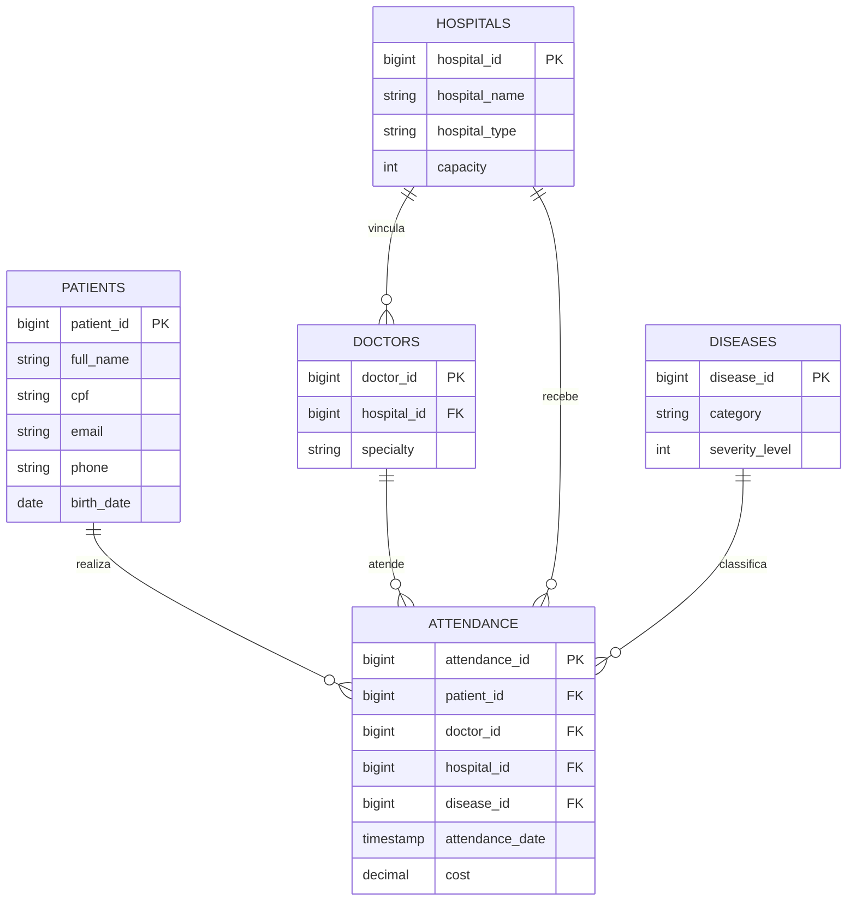
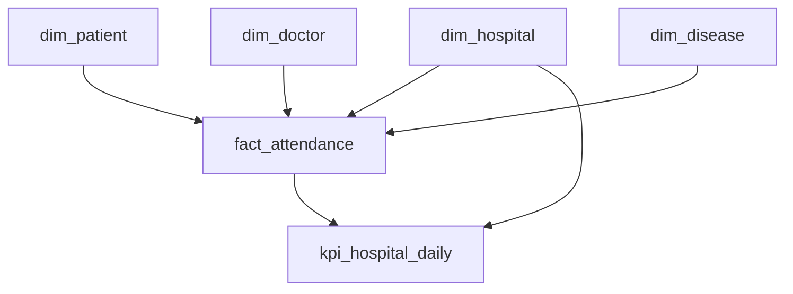

# Data Master - HealthLake

Plataforma de engenharia de dados desenvolvida com **Python, Amazon S3, Azure Data Factory, Azure Event Hubs, Azure Data Lake Storage Gen2 e Azure Databricks**. O projeto implementa uma arquitetura de dados com processamento **batch mensal e streaming**, cobrindo todo o ciclo de dados: desde a **geração sintética de dados de saúde e ingestão**, passando pelas etapas de processamento e transformação nas camadas **Bronze e Silver**, até a disponibilização de dados tratados e modelados na camada **Gold**, prontos para consumo analítico.

## Sumário

1. [**Objetivo do Case**](#1-objetivo-do-case)
2. [**Arquitetura de Solução e Arquitetura Técnica**](#2-arquitetura-de-solução-e-arquitetura-técnica)
3. [**Explicação sobre o Case Desenvolvido**](#3-explicação-sobre-o-case-desenvolvido)
4. [Guia de configuração e execução](#4-guia-de-configuração-e-execução)
5. [**Próximos Passos e Considerações Finais**](#5-proximos-passos-e-considerações-finais)
6. [**Referências**](#6-referencias)

---

## 1. **Objetivo do Case**

### 1.1 Contexto

O desafio solicita uma solução de engenharia de dados capaz de tratar volume, velocidade e variedade, cobrindo **Extração de Dados**, **Ingestão de Dados**, **Armazenamento de Dados**, **Observabilidade**, **Segurança de Dados**, **Mascaramento de Dados**, **Arquitetura de Dados**, **Escalabilidade** e **Reprodutibilidade da Arquitetura**.

O tema escolhido é saúde. A plataforma simula hospitais, pacientes, médicos, doenças, atendimentos e sinais vitais, preserva os dados brutos em um data lake, aplica controles de qualidade e publica um modelo analítico com indicadores operacionais por hospital.

### 1.2 Objetivos técnicos

- Gerar snapshots sintéticos em CSV, particionados por data lógica (`odate`), com seed, churn e anomalias controladas.
- Transportar o batch do Amazon S3 para o ADLS Gen2 por meio do Azure Data Factory (ADF).
- Gerar eventos sintéticos em tempo quase real com um Producer em Python, simulando chegadas, alterações e anomalias de dados.
- Publicar e distribuir os eventos por meio do Azure Event Hubs.
- Organizar o processamento em Raw, Bronze, Silver e Gold, seguindo o padrão Medallion.
- Usar Apache Spark Declarative Pipelines (SDP), Lakeflow Pipelines e Delta Lake para processamento distribuído e tabelas transacionais.
- Bloquear promoções de camada quando regras críticas de qualidade falharem, mantendo métricas e quarentena.
- Reduzir a exposição de identificadores diretos antes do consumo analítico (`PIIs`).
- Governar acessos por grupos e privilégios do Unity Catalog.
- Versionar jobs, pipelines, dashboard e recursos Databricks com Declarative Automation Bundles.

### 1.3 Perguntas de negócio atendidas pela Gold

A tabela `kpi_hospital_daily` permite responder, por hospital e dia:

- Quantos atendimentos foram realizados?
- Qual foi o tempo médio de espera?
- Qual foi o custo total registrado?
- Qual foi a taxa de alta entre atendimentos cuja flag é conhecida?
- Como esses indicadores variam por tipo de hospital, estado e cidade?

---

## 2. **Arquitetura de Solução e Arquitetura Técnica**

### 2.1 Arquitetura de solução


### 2.2 Arquitetura Técnica


A arquitetura técnica apresenta uma plataforma Lakehouse híbrida, com processamento batch e streaming, centralizada no Azure Databricks e estruturada segundo a arquitetura Medallion. No fluxo batch, snapshots sintéticos armazenados no Amazon S3 são transportados pelo Azure Data Factory para o ADLS Gen2 e processados pelas camadas Raw, Bronze, Silver e Gold. Já no fluxo streaming, eventos gerados por um Producer em Python são publicados no Azure Event Hubs e consumidos continuamente pelo Databricks. Em ambos os casos, o processamento utiliza Lakeflow Pipelines, Spark Declarative Pipelines e Delta Lake, permitindo processamento distribuído, transações ACID, evolução de schema e reprocessamento controlado.

Entre as camadas são aplicadas regras de Data Quality, como completude, unicidade, consistência, tipos e regras de negócio, com possibilidade de direcionamento de registros inválidos para quarentena. A camada Silver concentra limpeza, deduplicação, normalização e minimização de PII, enquanto a Gold organiza os dados em Star Schema, com fatos, dimensões, agregações e KPIs destinados ao consumo analítico. A solução ainda incorpora mecanismos transversais de governança e segurança com Unity Catalog e Azure Key Vault, observabilidade com Databricks Dashboards e Logic Apps, checkpoints e mecanismos de recuperação no streaming, além de automação e versionamento dos recursos Databricks por meio de Declarative Automation Bundles e CI/CD.


### 2.3 Fluxo técnico end-to-end

| Etapa | Entrada | Processamento | Saída e controle |
| --- | --- | --- | --- |
| 1. Geração | Configuração e `id_control.json` | Faker/pandas criam registros, aplicam churn, nulos e duplicatas | CSV em `output/raw/odate=...` |
| 2. Landing AWS | Partição CSV local | `boto3.upload_file` envia os cinco datasets | `s3://<bucket>/raw/<dataset>/odate=<data>/<dataset>.csv` |
| 3. ADF | Parâmetros `odate`, bucket e datasets | `ForEach` paralelo verifica `exists`; `Copy` preserva hierarquia | `abfss://raw@<storage>/<dataset>/odate=<data>/<dataset>.csv` |
| 4. Bronze | CSVs no ADLS | Auto Loader faz leitura incremental e adiciona metadados | Cinco tabelas Delta Bronze |
| 5. Gate 1 | Uma `odate` das tabelas Bronze | Filtra a partição, limpa/deduplica/tipa e então aplica DQX | Métricas, quarentena `_v2`, aprovação conjunta das cinco tabelas ou bloqueio total |
| 6. Silver | Bronze aprovada | Snapshot atual, deduplicação, tipagem, padronização e máscaras | Cinco materialized views Silver |
| 7. Gate 2 | Uma `odate` das views Silver | Revalidação tipada antes do produto analítico | Métricas, quarentena `_v2`, aprovação conjunta ou bloqueio total |
| 8. Gold | Silver aprovada | Modelagem dimensional e agregação diária | Quatro dimensões, um fato e um KPI |
| 9. Consumo | Gold e métricas DQ | SQL Warehouse e dashboard AI/BI | Consultas analíticas e painel operacional |
| S1. Eventos | Contrato JSON v1 | Producer OAuth publica por `patient_id` | Um Event Hub, dois partitions, IDs UUID para deduplicação |
| S2. Bronze streaming | Kafka Event Hubs | Lakeflow preserva payload, hash, partition e offset | `bronze.vital_events_raw` append-only |
| S3. DQ/Silver | Bronze de eventos | Parse, limpeza e casts precedem 23 regras; erro vai à quarentena e falha o lote inteiro | `quarantine.vital_events` ou `silver.vital_events` deduplicada |
| S4. Gold streaming | Silver de eventos | Agregações temporais por paciente e população | `gold.vital_patient_5m` e `gold.vital_population_hourly` |

### 2.4 Modelo lógico do domínio



As relações representam o desenho lógico; PKs e FKs não são declaradas nem impostas no storage atual. O perfil `clean` reconcilia referências básicas dos dados gerados, mas o gate DQ ainda não executa anti-joins entre todas as tabelas para impor integridade referencial sobre qualquer fonte externa; essa lacuna permanece nas limitações.

## 3. **Explicação sobre o Case Desenvolvido**

### 3.1 Estrutura do Repositório

O repositório foi organizado por responsabilidade, separando geração e ingestão de dados, artefatos de orquestração, processamento no Databricks, infraestrutura como código, dados de exemplo e automações de CI/CD. Essa divisão busca facilitar a manutenção, o desenvolvimento independente dos componentes e a compreensão do fluxo end-to-end da solução.

```text
data-master-healthlake/
│
├── .github/
│   ├── CODEOWNERS
│   └── workflows/
│
├── adf/
│   ├── dataset/
│   ├── environments/
│   ├── factory/
│   ├── linkedService/
│   ├── pipeline/
│   ├── scripts/
│   ├── tests/
│   └── trigger/
│
├── data-generator/
│   ├── config/
│   ├── contracts/
│   ├── generators/
│   ├── ingestion-s3/
│   ├── metadata/
│   ├── producers/
│   ├── tests/
│   ├── utils/
│   ├── output/
│   └── main.py
│
├── databricks/
│   ├── resources/
│   ├── src/
│   │   ├── bronze/
│   │   ├── silver/
│   │   ├── gold/
│   │   ├── dq/
│   │   ├── streaming/
│   │   ├── governance/
│   │   └── dashboard/
│   ├── tests/
│   └── databricks.yml
│
├── infra/
│   ├── eventhub/
│   └── observability/
│
├── sample_data/
│
├── .gitignore
├── LICENSE
└── README.md
```

### `.github/`

Contém os artefatos relacionados ao ciclo de desenvolvimento e CI/CD do projeto.

* `CODEOWNERS`: define responsáveis por revisão e aprovação de alterações.
* `workflows/`: contém os workflows do GitHub Actions responsáveis por testes, validações e deploys dos ambientes de desenvolvimento e produção.

Os pipelines de CI executam, entre outras verificações, testes Python, validação dos templates Bicep, análise de sintaxe dos códigos Databricks e validação dos Declarative Automation Bundles.

---

### `data-generator/`

Responsável pela **geração sintética dos dados batch e streaming**, constituindo a principal origem de dados simulada da solução.

O ponto de entrada é:

```text
data-generator/main.py
```

A pasta está subdividida em componentes com responsabilidades específicas:

* `config/`: parâmetros de geração, volumes, percentuais de churn, duplicidade e valores nulos.
* `contracts/`: contratos de dados, incluindo o schema dos eventos de streaming.
* `generators/`: geradores específicos para pacientes, hospitais, médicos, doenças, atendimentos e sinais vitais.
* `utils/`: funções compartilhadas para snapshots, limpeza, geração de anomalias, metadata e manipulação de arquivos.
* `producers/`: implementação do produtor responsável pelo envio de eventos ao Azure Event Hubs.
* `ingestion-s3/`: scripts responsáveis pelo upload dos snapshots batch para o Amazon S3.
* `metadata/`: mantém informações de controle utilizadas pela geração incremental, como os últimos IDs gerados.
* `tests/`: testes automatizados dos contratos e perfis de geração.

A pasta `output/` contém os dados efetivamente gerados durante a execução:

```text
output/
├── raw/
│   ├── odate=YYYY-MM-DD/
│   │   ├── patients.csv
│   │   ├── hospitals.csv
│   │   ├── doctors.csv
│   │   ├── diseases.csv
│   │   └── attendance.csv
│
└── streaming/
    └── streaming_events_<producer_run_id>.jsonl
```

Os arquivos de `output/` **não são versionados no Git**, pois representam estado operacional e podem crescer significativamente conforme novas execuções são realizadas. O histórico dos dados deve ser mantido nas camadas de armazenamento da própria arquitetura, como Amazon S3 e ADLS Gen2, evitando utilizar o Git como armazenamento de datasets.

---

### `adf/`

Contém os artefatos versionados do **Azure Data Factory**, responsável pela movimentação dos snapshots batch do Amazon S3 para o ADLS Gen2.

As principais estruturas são:

* `linkedService/`: conexões do ADF com Amazon S3, Azure Key Vault e ADLS Gen2.
* `dataset/`: datasets parametrizados utilizados pelas atividades de leitura e escrita.
* `pipeline/`: definição do pipeline de ingestão S3 → ADLS.
* `trigger/`: configuração do trigger associado à ingestão.
* `environments/`: parâmetros específicos dos ambientes `dev` e `prod`.
* `factory/`: definições das Data Factories utilizadas pelos ambientes.
* `scripts/`: scripts PowerShell para deploy dos artefatos.
* `tests/`: testes de contrato que validam a configuração versionada do ADF.

O principal pipeline é:

```text
pl_copy_s3_to_adls_raw
```

Ele valida a existência dos arquivos esperados no S3 e realiza a cópia paralela dos datasets para a camada Raw do ADLS.

---

### `databricks/`

Centraliza todo o processamento executado no **Azure Databricks**, incluindo as camadas Bronze, Silver e Gold, Data Quality, streaming, governança e observabilidade.

O arquivo:

```text
databricks/databricks.yml
```

é o ponto principal do **Declarative Automation Bundle**, contendo variáveis, targets de ambiente e referências aos recursos que serão implantados.

A pasta `resources/` contém as definições declarativas de:

* Lakeflow Pipelines;
* Jobs;
* pipelines Bronze, Silver e Gold;
* quality gates;
* pipeline de streaming;
* recursos de observabilidade;
* alertas e dashboard.

Já `src/` contém o código efetivamente executado:

```text
src/
├── bronze/
├── silver/
├── gold/
├── dq/
├── streaming/
├── governance/
└── dashboard/
```

#### `src/bronze/`

Responsável pela ingestão incremental dos arquivos da camada Raw utilizando Auto Loader e Spark Declarative Pipelines.

#### `src/silver/`

Contém as transformações de limpeza, normalização, tipagem, deduplicação e redução da exposição de PII.

#### `src/gold/`

Implementa o modelo analítico, incluindo dimensões, fato de atendimentos e KPIs utilizados para consumo analítico.

#### `src/dq/`

Implementa os **quality gates fail-closed** utilizando DQX. Os gates controlam a promoção:

```text
Bronze → Silver → Gold
```

Registros inválidos são direcionados para quarentena e violações críticas impedem a promoção da partição.

#### `src/streaming/`

Contém o consumidor e as transformações dos eventos de sinais vitais recebidos pelo Azure Event Hubs.

#### `src/governance/`

Mantém artefatos relacionados à governança do Unity Catalog, incluindo grants e definição da matriz de acesso dos grupos consumidores.

#### `src/dashboard/`

Contém os artefatos versionados relacionados ao dashboard de observabilidade.

A pasta `tests/` contém testes de contrato dos pipelines, governança, streaming e observabilidade.

---

### `infra/`

Contém os recursos de **Infrastructure as Code (IaC)** complementares à plataforma.

Atualmente está dividida em:

```text
infra/
├── eventhub/
└── observability/
```

#### `infra/eventhub/`

Responsável pelo provisionamento da infraestrutura de streaming, incluindo:

* Azure Event Hubs Namespace;
* Event Hub de sinais vitais;
* partitions;
* consumer group;
* Access Connector;
* Managed Identity;
* RBAC;
* integração com Unity Catalog.

Os recursos são descritos utilizando **Azure Bicep** e acompanhados por scripts PowerShell de validação e deploy.

#### `infra/observability/`

Mantém a infraestrutura de observabilidade externa ao Databricks, incluindo a Logic App responsável por receber notificações operacionais e monitorar determinadas execuções do ADF.

---

### `sample_data/`

Contém pequenos datasets sintéticos utilizados como **amostras e fixtures de referência**.

Diferentemente dos snapshots completos gerados em `data-generator/output/`, esses arquivos são pequenos o suficiente para serem versionados e permitem:

* visualizar o schema esperado;
* entender o domínio do case;
* realizar inspeções rápidas;
* apoiar testes e demonstrações;
* fornecer exemplos sem versionar grandes volumes de dados.

A existência de `sample_data/` permite separar claramente:

```text
Dados de exemplo
sample_data/
→ pequenos
→ versionados no Git

Dados gerados operacionalmente
data-generator/output/
→ potencialmente grandes
→ ignorados pelo Git
→ persistidos em S3/ADLS
```

---

### 3.2 Dados e granularidade

| Dataset | Granularidade | Chave | Principais atributos | Classificação |
| --- | --- | --- | --- | --- |
| `patients` | Um paciente no snapshot | `patient_id` | nome, CPF, e-mail, telefone, sexo, tipo sanguíneo, nascimento, localidade | Identificadores diretos e dados pessoais/sensíveis |
| `hospitals` | Um hospital no snapshot | `hospital_id` | nome, tipo, cidade, UF, capacidade | Cadastro institucional |
| `doctors` | Um médico no snapshot | `doctor_id` | nome, CRM, especialidade, hospital | Dados pessoais profissionais e vínculo institucional |
| `diseases` | Uma doença no snapshot | `disease_id` | nome, categoria, severidade | Classificação de saúde |
| `attendance` | Um atendimento | `attendance_id` | paciente, médico, hospital, doença, espera, custo, severidade e alta | Evento assistencial sensível |
| `streaming_events` | Uma medição simulada | `event_id` | paciente, frequência cardíaca, oxigenação, temperatura e pressão | Telemetria sensível |

<details>
<summary>Dicionário físico dos arquivos de origem</summary>

| Dataset | Colunas |
| --- | --- |
| `patients.csv` | `patient_id`, `full_name`, `cpf`, `email`, `phone`, `gender`, `blood_type`, `birth_date`, `city`, `state`, `created_at` |
| `hospitals.csv` | `hospital_id`, `hospital_name`, `hospital_type`, `state`, `city`, `capacity`, `created_at` |
| `doctors.csv` | `doctor_id`, `doctor_name`, `crm`, `specialty`, `hospital_id`, `created_at` |
| `diseases.csv` | `disease_id`, `disease_name`, `category`, `severity_level`, `created_at` |
| `attendance.csv` | `attendance_id`, `patient_id`, `doctor_id`, `hospital_id`, `disease_id`, `attendance_date`, `wait_time_minutes`, `cost`, `severity_score`, `discharge_flag`, `created_at` |
| `streaming_events_<producer_run_id>.jsonl` | `schema_version`, `event_id`, `event_type`, `patient_id`, sinais vitais com unidade, `event_time`, `produced_at`, `producer_run_id`, `source` |

</details>

Os cinco CSVs de `sample_data/` têm 41 registros cada, além do cabeçalho, e o JSONL tem 100 eventos. As amostras contêm nulos e duplicatas para inspeção de qualidade, mas nenhum código as carrega automaticamente.

### 3.3 **Extração de Dados** e geração sintética

O ponto de entrada é [`data-generator/main.py`](data-generator/main.py). Em modo batch, cada `odate` representa uma fotografia completa:

1. O gerador procura a partição anterior mais recente.
2. Remove aleatoriamente uma fração configurada de registros para simular churn.
3. Gera novos IDs a partir de [`id_control.json`](data-generator/metadata/id_control.json).
4. No perfil default `chaos`, injeta nulos e duplicatas segundo [`settings.py`](data-generator/config/settings.py); no perfil `clean`, não injeta novas anomalias.
5. Concatena registros retidos e novos.
6. Em `clean`, saneia também os registros retidos: preserva o contrato de colunas, normaliza campos, remove obrigatórios inválidos, deduplica chaves e reconcilia as referências de atendimentos com as dimensões presentes.
7. Grava cada CSV por arquivo temporário e rename, reduzindo o risco de arquivo individual incompleto.
8. Avança o controle de IDs somente depois de salvar todos os snapshots.

Configuração versionada de novos registros por execução:

| Dataset | Novos registros |
| --- | ---: |
| Pacientes | 150 |
| Hospitais | 0 |
| Médicos | 2 |
| Doenças | 0 |
| Atendimentos | 2.500 |

A CLI aceita `--profile clean|chaos`. Use `clean` para uma execução destinada à Gold e uma `odate` separada com `chaos` para demonstrar o bloqueio. A seed configura os geradores pseudoaleatórios (PRNGs) de `random`, NumPy e Faker. Isso melhora a repetibilidade, mas não garante sozinho uma reprodução byte a byte: o resultado também depende da versão das bibliotecas, do relógio usado por `end_date="now"`, do estado de IDs e dos snapshots anteriores. A própria documentação do Faker restringe a garantia à mesma versão. A opção `--overwrite` substitui arquivos da partição, mas também gera novos dados e avança novamente os IDs; ela não funciona como replay idempotente. Como o mesmo caminho é reutilizado e o Auto Loader não habilita `cloudFiles.allowOverwrites`, essa sobrescrita normalmente também não atualiza a Bronze depois que o arquivo já foi descoberto.

No modo de eventos, o gerador cria um contrato v1 por linha com UUID imutável,
timestamps UTC e unidades explícitas, gravando um JSONL novo por
`producer_run_id`. O produtor autentica com `DefaultAzureCredential`, agrupa os
batches por `patient_id` para manter ordenação por paciente e respeita o tamanho
máximo do Event Hubs. Não há connection string no código ou no Bundle.

### 3.4 **Ingestão de Dados** batch

#### 3.4.1 Upload para o S3

[`upload_to_s3.py`](data-generator/ingestion-s3/upload_to_s3.py) valida `odate`, exige uma partição local com CSVs e usa a cadeia padrão de credenciais do Boto3. Cada arquivo é enviado para:

```text
s3://<bucket>/raw/<dataset>/odate=<YYYY-MM-DD>/<dataset>.csv
```

O upload é sequencial e não grava manifest ou marcador de conclusão. Em produção, um manifest contendo quantidade, tamanho e checksum permitiria ao orquestrador rejeitar partições parciais.

#### 3.4.2 S3 para ADLS com ADF

O pipeline [`pl_copy_s3_to_adls_raw`](adf/pipeline/pl_copy_s3_to_adls_raw.json) recebe:

| Parâmetro | Tipo | Finalidade |
| --- | --- | --- |
| `odate` | string | Partição lógica obrigatória |
| `s3_bucket_name` | string | Bucket de origem |
| `dataset_names` | array | Lista de cinco datasets, com default versionado |

Para cada dataset, o ADF:

- executa `GetMetadata` para verificar `exists`;
- falha com `S3_RAW_FILE_NOT_FOUND` quando o objeto esperado não existe;
- copia o arquivo como binário, sem transformação;
- preserva a estrutura `<dataset>/odate=<data>/<dataset>.csv`;
- permite até cinco iterações paralelas (`batchCount: 5`);
- tenta novamente a cópia duas vezes, com intervalo de 60 segundos.

As chaves do S3 são referenciadas pelos secrets `aws-s3-access-key-id` e `aws-s3-secret-access-key` no Azure Key Vault. O repositório não armazena seus valores.

O pipeline mantém a anotação histórica `manual`, mas o repositório contém o
artefato `adf/trigger/trigger_case.json`, que declara uma cópia mensal no dia 05
e deriva a `odate` do horário agendado no fuso de São Paulo. Os workflows atuais
não publicam `adf/**` e a factory de desenvolvimento auditada não possui trigger
implantado. Além disso, o artefato local ainda não inicia o Job Databricks;
portanto, a passagem ADF -> Databricks continua exigindo uma ação separada do
operador.

### 3.5 **Ingestão de Dados** streaming

Produção usa exatamente um namespace `evhns-healthlake-prod-brs-01` Standard,
um hub `evh-vitals-prod`, 1 TU, duas partições e três dias de retenção. Capture,
auto-inflate e autenticação SAS/local ficam desabilitados. O Bicep também cria
um Access Connector com managed identity, que recebe somente `Azure Event Hubs
Data Receiver` no escopo do hub. A service credential isolada do Unity Catalog
é vinculada somente ao workspace produtivo e acessível pelo runtime
`sp-healthlake-prod-pipeline`.

Lakeflow consome o endpoint Kafka com OAuth. O pipeline é streaming quanto à
fonte e ao checkpoint, mas opera em modo **triggered**, não contínuo: uma run
drena os offsets disponíveis até Bronze, DQ, Silver e Gold e então encerra o
compute. Isso é mais econômico para este case do que manter um cluster contínuo.
A agenda horária está declarada, porém implantada `PAUSED`; com produtor ativo,
ela deve ser ativada ou executada manualmente ao menos uma vez por dia para não
exceder a retenção.

A Bronze é imutável e guarda payload, partition, offset, enqueue time e SHA-256.
Depois do parse e da limpeza, o DQ registra todas as violações. Qualquer evento
inválido é encaminhado à quarentena e o `expect_or_fail` bloqueia a atualização
inteira da Silver e, por dependência, da Gold. Eventos válidos são deduplicados
por `event_id` com watermark de 25 horas, uma hora além da janela DQ de atraso
aceita. As Gold publicam janelas de cinco
minutos por paciente e uma hora para a população.

### 3.6 Camada Raw

A Raw no ADLS preserva os bytes copiados do S3:

```text
abfss://raw@<storage-account>.dfs.core.windows.net/
|-- patients/odate=YYYY-MM-DD/patients.csv
|-- hospitals/odate=YYYY-MM-DD/hospitals.csv
|-- doctors/odate=YYYY-MM-DD/doctors.csv
|-- diseases/odate=YYYY-MM-DD/diseases.csv
`-- attendance/odate=YYYY-MM-DD/attendance.csv
```

Essa zona permite auditoria e reprocessamento somente enquanto os objetos originais forem preservados. Ela é tratada conceitualmente como append-only, mas o uploader e o ADF podem substituir o mesmo caminho. Políticas de imutabilidade, versionamento, lifecycle e retenção são recomendações de produção e não estão declaradas no repositório.

### 3.7 Camada Bronze

[`ingestion.py`](databricks/src/bronze/ingestion.py) usa `spark.readStream.format("cloudFiles")` para ler incrementalmente os cinco diretórios. A configuração:

- interpreta CSV com cabeçalho UTF-8;
- infere tipos;
- usa `schemaEvolutionMode = rescue`;
- envia incompatibilidades para `_rescued_data`;
- registra `_source_file` e `_ingested_at`;
- extrai `odate` do segmento completo `odate=YYYY-MM-DD` com regex validado;
- usa `expect_or_fail` para interromper a atualização inteira quando o path não fornece uma `odate` válida;
- monitora chaves ausentes com expectations sem descartar silenciosamente a linha antes da limpeza e do DQ.

| Tabela Bronze | Origem Raw | Chave monitorada |
| --- | --- | --- |
| `bronze.patients` | `raw/patients` | `patient_id` |
| `bronze.hospitals` | `raw/hospitals` | `hospital_id` |
| `bronze.doctors` | `raw/doctors` | `doctor_id` |
| `bronze.diseases` | `raw/diseases` | `disease_id` |
| `bronze.attendance` | `raw/attendance` | `attendance_id` |

O Auto Loader mantém estado de ingestão e evita reler arquivos já processados dentro do checkpoint gerenciado pelo Lakeflow. A Bronze é histórica e recebe snapshots completos de várias datas. Como `cloudFiles.allowOverwrites` não está configurado, o desenho seguro é publicar um caminho imutável por execução; replay no mesmo path exige política explícita de overwrite, deduplicação e reconciliação.

### 3.8 Gate de qualidade Bronze -> Silver

O Job DQX recebe uma `odate` explícita, filtra somente essa partição em cada tabela Bronze e falha se qualquer uma das cinco entidades não tiver linhas. Antes de aplicar regras, ele usa as mesmas transformações puras da Silver para deduplicar, tipar, normalizar e mascarar os dados. Essa limpeza também remove registros incompletos em campos não-chave antes do DQ; a reconciliação fica registrada como `removed_by_cleaning = input_rows - checked_rows` dentro de `violation_summary`. Só então o DQX divide linhas válidas e inválidas, mascara PII de pacientes na quarentena `_v2` e grava métricas em `<catalog>.observability.dq_run_metrics`. O sufixo `_v2` separa o schema tipado pós-limpeza das quarentenas raw legadas, incompatíveis para `mergeSchema`.

| Entidade | Regras principais |
| --- | --- |
| Pacientes | ID presente/único, nascimento não futuro, sexo `M/F`, UF com duas letras |
| Hospitais | ID presente/único, capacidade entre 1 e 2.000, UF válida |
| Médicos | ID presente/único, CRM positivo, hospital presente |
| Doenças | ID presente/único, severidade entre 1 e 5 |
| Atendimentos | ID e FKs presentes, data não futura, espera 0-300, custo não negativo, severidade 1-5, alta 0/1 |

Depois da limpeza, qualquer violação restante gera status `FAILED`, persiste a quarentena e lança erro para impedir a Silver; nenhuma fração válida da tabela é promovida. O split válido nunca é salvo diretamente. Somente quando as cinco tabelas passam o Job atualiza `<catalog>.observability.dq_promotion_control`; esse é o único sinal consumido pela Silver. Assim, as cinco tabelas são promovidas juntas ou nenhuma é atualizada. O perfil `clean` sustenta o caminho de sucesso, enquanto `chaos` demonstra deliberadamente quarentena e bloqueio.

### 3.9 Camada Silver

[`transforms.py`](databricks/src/silver/transforms.py) trata cada `odate` como snapshot completo e lê apenas a data aprovada para `bronze_to_silver` em `dq_promotion_control`. O módulo compartilhado [`cleaning.py`](databricks/src/silver/cleaning.py) repete deterministicamente a mesma deduplicação, tipagem e normalização validadas pelo gate. Expectations `expect_or_fail` interrompem a materialização inteira se o contrato de qualquer view for violado.

| View Silver | Transformações relevantes |
| --- | --- |
| `patients_current` | Tipagem, trim/uppercase e máscaras de nome, CPF, e-mail e telefone |
| `hospitals_current` | Capacidade inteira, UF uppercase e textos normalizados |
| `doctors_current` | CRM/IDs bigint, textos normalizados |
| `diseases_current` | Severidade inteira e textos normalizados |
| `attendance_current` | Timestamp/data, custo `decimal(12,2)`, severidade inteira e flag booleana |

As views mantêm `snapshot_date`, `_source_file` e `_ingested_at` para rastreabilidade. O modelo tem semântica de current snapshot análoga a SCD Type 1, sem implementar uma dimensão SCD por `MERGE`; não mantém histórico dimensional Type 2.

### 3.10 **Mascaramento de Dados** e minimização

Os identificadores diretos recebem máscaras de apresentação ao entrar na Silver e antes de uma linha de paciente ser gravada na quarentena:

| Campo | Forma resultante | Exemplo conceitual |
| --- | --- | --- |
| `full_name` | Primeira letra + `***` | `M***` |
| `cpf` | Apenas dois últimos dígitos visíveis | `***.***.***-42` |
| `email` | Primeira letra + domínio | `m***@example.com` |
| `phone` | Apenas quatro últimos dígitos | `***-1234` |

A Gold exclui nome, CPF, e-mail e telefone da dimensão de pacientes. Ainda assim, isso é minimização e redação de identificadores, não prova de anonimização: `patient_id`, localização, nascimento, eventos assistenciais e combinações de atributos podem permitir reidentificação. A dimensão de médicos também mantém `doctor_name`. Portanto, a Gold não é livre de dados pessoais nem anônima; Raw e Bronze mantêm PII integral para finalidades técnicas controladas. Uma avaliação formal deve considerar base legal, finalidade, necessidade, retenção, risco de reidentificação, direitos do titular e controles organizacionais.

### 3.11 Gate de qualidade Silver -> Gold

O segundo gate filtra as views tipadas pela mesma `odate` recebida pelo Job e repete verificações essenciais:

- chaves presentes e únicas;
- `snapshot_date` presente para pacientes;
- capacidade hospitalar válida;
- vínculos obrigatórios presentes;
- data de atendimento presente;
- custo não negativo;
- severidade dentro do domínio.

Apenas quando as cinco views passam o controle de promoção de `silver_to_gold` é atualizado e o Job executa a Gold. A fact usa `expect_or_fail` para que uma data de atendimento ausente aborte a atualização inteira, em vez de salvar uma tabela parcialmente filtrada.

### 3.12 Camada Gold

[`marts.py`](databricks/src/gold/marts.py) publica um esquema estrela:



| Produto | Grão | Conteúdo |
| --- | --- | --- |
| `dim_patient` | Um paciente atual | Sexo, tipo sanguíneo, nascimento, cidade, UF e data do snapshot; sem nome, CPF, e-mail e telefone, mas ainda com `patient_id` e quasi-identificadores |
| `dim_hospital` | Um hospital atual | Nome, tipo, localidade, capacidade e snapshot |
| `dim_doctor` | Um médico atual | Nome, especialidade, hospital e snapshot |
| `dim_disease` | Uma doença atual | Nome, categoria, severidade e snapshot |
| `fact_attendance` | Um atendimento | Chaves dimensionais, data/hora, espera, custo, severidade, alta e snapshot |
| `kpi_hospital_daily` | Um hospital por dia | Quantidade, espera média, custo total e taxa de alta, enriquecidos com o hospital |

Fórmulas do KPI:

- `attendance_count = count(attendance_id)`
- `avg_wait_time_minutes = avg(wait_time_minutes)`
- `total_cost = sum(cost)`
- `discharge_rate = avg(cast(is_discharged as double))`; como `avg` ignora nulos, o denominador contém somente atendimentos cuja flag de alta é conhecida

### 3.13 **Segurança de Dados**

Controles presentes no código e na configuração:

| Camada | Controle |
| --- | --- |
| S3 -> ADF | Chaves referenciadas no Key Vault, sem valores no Git |
| ADF | Factory declara managed identity system-assigned |
| ADLS | Endpoint separado para Raw; autorização deve ser configurada por RBAC/ACL fora do Git |
| Databricks | OAuth M2M nos workflows e separação de catálogos `healthlake_dev`/`healthlake_prod` |
| Unity Catalog | Grants por grupos, sem grants diretos a pessoas no SQL versionado |
| Silver/Gold | Máscaras e exclusão de nome, CPF, e-mail e telefone de pacientes na Gold; outros dados pessoais e quasi-identificadores permanecem |
| GitHub Actions | Secrets e variables por Environment; produção pode exigir aprovação |

Matriz humana declarada em [`unity_catalog_access.sql`](databricks/src/governance/unity_catalog_access.sql):

| Grupo | Dev Bronze | Dev Silver | Dev Gold | Prod Bronze | Prod Silver | Prod Gold |
| --- | --- | --- | --- | --- | --- | --- |
| `data-engineering-admin` | Leitura | Leitura | Leitura | Leitura | Leitura | Leitura |
| `data-engineering` | — | Leitura | Leitura | — | Leitura | Leitura |
| `data-analysts` | — | — | — | — | Leitura | Leitura |
| `data-scientists` | — | — | — | — | Leitura | Leitura |
| `power-bi` | — | — | — | — | Leitura | Leitura |

Todos os cinco são grupos humanos estritamente de leitura. O nome
`data-engineering-admin` representa o administrador funcional que pode
inspecionar todas as camadas; ele não recebe escrita, ownership, `MANAGE` nem
administração do workspace. Em dev, apenas os dois grupos de engenharia devem
ser atribuídos ao workspace. Em prod, os cinco devem ser atribuídos.

Escrita, execução de pipelines e deploy devem pertencer a identidades de
serviço dedicadas. O SQL acima não cria grupos, não gerencia seus membros, não
concede permissões de workspace/warehouse e não é executado automaticamente
pelo Bundle; esses itens são pré-requisitos administrativos separados.

Para uso real, também são necessários: bloqueio de acesso público, TLS obrigatório, criptografia em repouso validada, private endpoints/VNet, rotação de credenciais, logs de auditoria, política de retenção/expurgo, segregação de funções, resposta a incidentes e avaliação de impacto. O uso de serviços que criptografam por padrão não substitui a verificação da configuração efetiva.

### 3.14 **Observabilidade**

| Sinal | Origem | Uso |
| --- | --- | --- |
| Existência do arquivo | ADF `GetMetadata` | Falha cedo quando a partição S3 está incompleta |
| Retries e status de cópia | ADF pipeline run | Diagnóstico de ingestão e conectividade |
| `_source_file`, `_ingested_at`, `snapshot_date` | Bronze/Silver | Rastreabilidade de arquivo e tempo |
| Expectation metrics | Lakeflow | Contagem de violações e falhas transacionais por `expect_or_fail` |
| `dq_run_metrics` | DQX | `odate`, `input_rows`, `checked_rows`, `removed_by_cleaning` em `violation_summary`, válidos, quarentena, status, tabela e run ID |
| `dq_promotion_control` | DQX/Silver | Única `odate` aprovada por estágio, atualizada somente depois que as cinco tabelas passam |
| Event log `vital_streaming_pipeline_events` | Lakeflow | Estado do update, volume/status por flow, expectations e backlog observado durante a run |
| Tabelas de sistema `system.lakeflow.*` | Databricks | Estado e duração de Jobs e Pipeline, incluindo falha/cancelamento |
| E-mail + Logic App Consumption | Jobs Databricks e ADF produtivos | Webhooks de falha/duração e verificação mensal da ingestão S3 → ADLS no dia 05 |
| Dashboard AI/BI produtivo | SQL Warehouse | DQ batch por `odate`, DQ/flows streaming, frescor, latência, quarentena e reconciliação |

Toda a camada operacional foi concentrada em produção. Dev não possui dashboard,
SQL Warehouse de observabilidade nem notificações. O dashboard produtivo é
publicado com a credencial do service principal, permite somente `CAN_RUN` a
`data-engineering-admin` e `data-engineering` e não expõe payload, mensagem de
erro bruta ou `patient_id`. Não há refresh agendado, subscription, SQL Alert,
Lakehouse Monitor nem tabela observacional materializada: as consultas rodam
somente quando alguém abre/atualiza o painel. O Warehouse serverless é 2X-Small,
máximo de um cluster, auto-stop de 10 minutos e o CI o para novamente após cada
deploy.

A Logic App `logic-healthlake-alerts-prod-brs-01` recebe webhooks de
falha/duração do workspace produtivo e, no dia 05 às 23:55, consulta diretamente
o histórico do ADF PROD. Se não existir uma run `Succeeded` de
`pl_copy_s3_to_adls_raw` para a `odate` do dia 05, envia e-mail sem iniciar o
pipeline. A identidade gerenciada possui somente as permissões de consulta de
runs; DEV não possui Logic App, diagnostic setting nem Log Analytics.
O backlog mostrado é deliberadamente rotulado como observado no último refresh:
com a Pipeline `IDLE`, o Databricks não conhece eventos que chegaram depois.
Ainda não há custo financeiro/DBUs no painel, backlog realmente atual do Event
Hubs, atraso S3/ADF ponta a ponta nem SLO formal.

### 3.15 **Escalabilidade**

Mecanismos existentes:

- ADF processa os cinco datasets em paralelo (`isSequential: false`, `batchCount: 5`).
- Auto Loader descobre arquivos incrementalmente e mantém checkpoint gerenciado.
- Lakeflow Pipelines usa compute serverless e execução acionada, evitando cluster permanente.
- O produtor Event Hubs agrupa eventos por paciente até o limite do lote; o
  consumidor limita cada micro-batch a 10.000 offsets.
- Os jobs batch usam fila; o streaming recusa sobreposição (`queue: false`),
  não tenta novamente automaticamente e limita `max_concurrent_runs` a 1.
- O SQL Warehouse é serverless, Photon e 2X-Small, com auto-stop de 10 minutos.

Estratégias para crescimento:

| Dimensão | Horizontal | Vertical |
| --- | --- | --- |
| Cópia batch | Mais datasets/arquivos em paralelo e Integration Runtime scale-out | Mais Data Integration Units (DIUs) por Copy Activity |
| Spark/Lakeflow | Particionamento de arquivos, mais tarefas e serverless autoscaling | Workers maiores quando o gargalo for memória/CPU por tarefa |
| Event Hubs | Mais partições e consumidores independentes | Mais throughput/processing units e auto-inflate |
| SQL | Mais clusters concorrentes | Warehouse maior |

O case ainda não comprova capacidade de grande volume por teste de carga. O DQX agora filtra a partição-alvo antes da limpeza e das janelas de unicidade, evitando calcular sobre toda a Bronze histórica. Ainda é necessário medir e reduzir ações Spark repetidas dentro dessa partição, compactar arquivos pequenos e definir metas mensuráveis de volume, latência, custo e disponibilidade.

### 3.16 CI/CD e ambientes

| Workflow | Gatilho | Ações |
| --- | --- | --- |
| `ci.yml` | Push/PR em `develop` ou `main` | Python 3.11, suíte pytest incluindo ADF/IaC, compileall, Bicep pinado e `bundle validate` dev; depois de um push aprovado em `main`, chama o deploy produtivo somente se todo o CI passar |
| `deploy-dev.yml` | Push em `develop` com mudança em `databricks/**` ou `.github/workflows/**`, ou execução manual | Valida e faz deploy do target `dev` |
| `deploy-prod.yml` | Chamado automaticamente pelo CI de `main`, ou manualmente | Checkout do SHA aprovado, valida, bloqueia planos destrutivos e faz deploy do target `prod`; batch só executa por chamada manual com opt-in e `odate` |
| `run-streaming-prod.yml` | Execução manual confirmada em `main` | Valida o target implantado e drena o backlog uma vez com token idempotente por GitHub run, sem reenviar eventos |

Os deploys usam OAuth M2M e GitHub Environments. Configure:

| Nome | Tipo | Ambiente |
| --- | --- | --- |
| `DATABRICKS_HOST` | Variable | Development e production |
| `DATABRICKS_CLIENT_ID` | Variable | Development e production |
| `DATABRICKS_CLIENT_SECRET` | Secret | Development e production |

O `CODEOWNERS` e a proteção de `main` formam o gate humano: somente PR aprovado pelo owner e com CI verde pode ser mesclado. O Environment `production` restringe a branch a `main`; adicionar um reviewer também nesse Environment cria um segundo gate manual e deixa o deploy aguardando aprovação. O workflow rejeita refs diferentes de `main`, faz checkout do SHA do próprio run e fixa as actions por commit. A Raw é versionada no Bundle como `abfss://raw@sthealthdatalake001.dfs.core.windows.net`; o catálogo `healthlake_prod` mantém seus dados gerenciados em `sthlkprodbrs01`.

O caller de produção usa `secrets: inherit` para disponibilizar os secrets ao workflow reutilizável. Antes da validação do Bundle, o workflow rejeita secret vazio e confirma a identidade OAuth com uma chamada de controle que não inicia compute.

O CI valida também os contratos de ambiente do ADF, Event Hubs e da Logic App
produtiva. O script `adf/scripts/deploy.ps1` publica os artefatos com trigger
parado; `infra/eventhub/scripts/deploy.ps1` faz validate/what-if, aplicação
deliberada, RBAC e configuração/pós-check da service credential; e
`infra/observability/scripts/deploy.ps1` cria a Logic App e reconcilia sua URL
assinada diretamente na notification destination criptografada do Databricks,
sem registrá-la no repositório.

O CI/CD promove automaticamente o Bundle depois de um merge aprovado em
`main`, sem executar batch ou streaming. Os scripts de fundação ainda precisam
ser incorporados a workflows protegidos com federação OIDC; o fluxo automático
também não aplica `unity_catalog_access.sql` nem executa smoke test cloud em
todo commit.

---

## 4. Guia de configuração e execução

### 4.1 Pré-requisitos

#### Máquina local

- Git.
- Python 3.11, igual ao CI.
- AWS CLI opcional para diagnóstico; o uploader usa Boto3.
- Azure CLI e a extensão `datafactory` para disparar/consultar o ADF por terminal, se desejado.
- Databricks CLI `>= 1.9.0`.
- Acesso de rede aos endpoints AWS/Azure.

#### Fundação cloud e recursos externos

O bootstrap completo ainda depende dos seguintes recursos. A linha do Event
Hubs é a exceção já provisionada pelo Bicep deste repositório:

- bucket S3 privado;
- Azure Key Vault;
- ADLS Gen2 com filesystem `raw`;
- Azure Data Factory com managed identity;
- Azure Event Hubs de produção, provisionável por `infra/eventhub/main.bicep`;
- workspace/região Azure Databricks com Unity Catalog e serverless habilitado para Lakeflow Pipelines, Jobs e SQL Warehouse;
- catálogos `healthlake_dev` e `healthlake_prod`;
- schemas `bronze`, `silver`, `gold`, `quarantine` e `observability`;
- storage credential/external location ou outra autorização governada para leitura do ADLS;
- grupos de conta/SCIM definidos no SQL de governança.

### 4.2 Clonar e preparar o Python

```powershell
git clone https://github.com/Ecardunk/data-master-healthlake.git
Set-Location .\data-master-healthlake

python -m venv .venv
.\.venv\Scripts\Activate.ps1
python -m pip install --upgrade pip
python -m pip install -r .\data-generator\requirements.txt
```

### 4.3 Variáveis locais

Crie `.env` na raiz. O arquivo é ignorado pelo Git.

```dotenv
S3_BUCKET_NAME=<bucket-privado>
AWS_REGION=<regiao-aws>

# Opcionais: somente para envio de eventos.
EVENTHUB_FULLY_QUALIFIED_NAMESPACE=evhns-healthlake-prod-brs-01.servicebus.windows.net
EVENTHUB_NAME=evh-vitals-prod
```

Não versione chaves. O produtor usa `DefaultAzureCredential`: localmente, faça
`az login` com uma identidade que tenha somente `Azure Event Hubs Data Sender`
no hub; em automação, use uma workload identity dedicada. Para o Boto3, prefira
perfil AWS, IAM Role ou credenciais temporárias.

### 4.4 Preparar ADF, Key Vault e ADLS

1. Ajuste os endpoints específicos do ambiente nos linked services:
   - Key Vault em [`ls_keyvault_healthlake.json`](adf/linkedService/ls_keyvault_healthlake.json);
   - ADLS em [`ls_adls_healthlake.json`](adf/linkedService/ls_adls_healthlake.json).
2. Crie no Key Vault os secrets `aws-s3-access-key-id` e `aws-s3-secret-access-key`.
3. Dê à managed identity do ADF `Get/List` via access policy ou `Key Vault Secrets User` via RBAC.
4. Dê à identidade do ADF permissão mínima de escrita no filesystem `raw` por RBAC/ACL.
5. Dê às credenciais AWS de leitura do ADF `s3:GetObject` e `s3:GetObjectVersion` no prefixo do case. Para teste/browse no ADF Studio, a documentação do conector também lista `s3:ListAllMyBuckets`, `s3:ListBucket` e `s3:GetBucketLocation`; evite concedê-las quando a validação puder usar um caminho específico.
6. Publique os datasets, linked services e pipeline da pasta `adf/` pela integração Git do ADF Studio ou por um processo de deploy criado para o ambiente.

> [!NOTE]
> Para managed identity atribuída pelo sistema, o linked service ADLS documentado contém `type: AzureBlobFS` e `url`, como o JSON versionado. A execução ainda depende das permissões efetivas da managed identity do ADF: para o sink, configure `Write` + `Execute` por ACL ou o papel `Storage Blob Data Contributor`, com o escopo mínimo necessário.

### 4.5 Preparar Unity Catalog e Databricks

Antes do Bundle:

1. Crie os catálogos e schemas listados nos pré-requisitos.
2. Autorize a identidade de execução a ler o `raw_root` do ADLS.
3. Conceda a essa identidade `USE CATALOG`/`USE SCHEMA` e os privilégios necessários para criar, ler e escrever os objetos Bronze, Silver, Gold, `quarantine` e `observability`, além de usar o SQL Warehouse e administrar os recursos implantados. O SQL de grupos humanos não concede esses privilégios à identidade de serviço.
4. Crie/sincronize os grupos de conta.
5. Revise os nomes de catálogo no SQL e execute [`unity_catalog_access.sql`](databricks/src/governance/unity_catalog_access.sql) com uma identidade autorizada.
6. Troque o e-mail default de alerta `dq_alert_email`.
7. Implante `infra/observability` em produção e confirme o UUID não secreto em
   `logic_app_notification_destination_id`.
8. Como account/metastore admin, execute
   [`observability_service_principal_access.prod.sql`](databricks/src/governance/observability_service_principal_access.prod.sql)
   para conceder ao publicador somente `USE CATALOG`, `USE SCHEMA` e `SELECT`
   em `system.lakeflow`; não conceda essas system tables aos grupos humanos.
9. Confirme o `workspace_id`, Pipeline ID e Job ID produtivos usados pelo dashboard.
10. Revise `raw_root`, host e nomes de storage em [`databricks.yml`](databricks/databricks.yml).

Os Jobs e Pipelines têm `run_as` explícito por ambiente: o service principal
`sp-healthlake-dev-pipeline` em dev e `sp-healthlake-prod-pipeline` em prod. Os
workflows autenticam via OAuth M2M; contas pessoais não são identidades de
execução. Prefira promover/deployar pelos workflows para manter uma única
instância do Bundle por ambiente.

Autenticação local de desenvolvimento:

```powershell
databricks auth login --host "<workspace-url>" --profile HEALTHLAKE_DEV
```

### 4.6 Atenção ao bootstrap de um clone limpo

No estado versionado, `id_control.json` contém IDs avançados, `hospitals` e `diseases` geram zero novos registros, e `data-generator/output/` não é versionado. Portanto, um clone limpo não possui os snapshots-base que justificam esses IDs. O perfil `clean` preserva os headers/contratos mesmo para datasets vazios e remove referências órfãs, mas não inventa os registros-base ausentes: sem snapshot anterior, hospitais e doenças continuam vazios e o gate fail-closed reprova a `odate`. `sample_data/` também não é usado automaticamente.

Antes da primeira carga reproduzível, implemente ou execute conscientemente uma destas opções:

1. Bootstrap limpo: zerar o metadata, configurar contagens positivas para as entidades-base e gerar o primeiro snapshot.
2. Seed controlada: carregar snapshots-base versionados/validados e alinhar o metadata ao maior ID.
3. Fixture de demonstração: publicar um conjunto pequeno e limpo diretamente no layout S3 esperado.

Depois de preparar uma base coerente, use `--profile clean` para a trilha até a Gold. O perfil saneia inclusive linhas retidas de snapshots anteriores. Use `--profile chaos` em outra `odate` para demonstrar o caminho esperado de falha/quarentena; `chaos` permanece como default por compatibilidade.

> [!CAUTION]
> O regex de `odate`, o gate DQ por partição, a limpeza antes das regras e os perfis `clean`/`chaos` já estão implementados. A sequência abaixo representa o caminho operacional no código, mas uma execução real ainda depende do bootstrap coerente, dos recursos/credenciais cloud e de registrar evidência da run no ambiente-alvo.

### 4.7 Gerar batch

```powershell
$odate = "2026-07-05"
python .\data-generator\main.py --odate $odate --seed 42 --profile clean
```

Saída esperada:

```text
data-generator/output/raw/odate=2026-07-05/
|-- patients.csv
|-- hospitals.csv
|-- doctors.csv
|-- diseases.csv
`-- attendance.csv
```

Para outra data, use um novo `odate`. Prefira um path/`odate` novo por execução. `--overwrite` avança o metadata, não reproduz a partição anterior e, após upload/cópia para o mesmo path, pode não atualizar a Bronze porque `cloudFiles.allowOverwrites` não está habilitado.

Para testar a quarentena, gere `--profile chaos` com uma segunda `odate`; não reutilize o path limpo.

### 4.8 Enviar a partição ao S3

```powershell
python .\data-generator\ingestion-s3\upload_to_s3.py --odate $odate
```

Valide se os cinco objetos existem antes de iniciar o ADF.

### 4.9 Executar o ADF

No ADF Studio, execute `pl_copy_s3_to_adls_raw` com `odate` e bucket. Via Azure CLI, instale explicitamente a extensão para evitar o prompt de instalação automática e selecione a assinatura:

```powershell
az extension add --name datafactory
az login
az account set --subscription "<subscription>"

az datafactory pipeline create-run `
  --resource-group "<resource-group>" `
  --factory-name "<data-factory>" `
  --name "pl_copy_s3_to_adls_raw" `
  --parameters '{"odate":"2026-07-05","s3_bucket_name":"<bucket>"}'
```

Só continue depois que a execução terminar com sucesso e os cinco arquivos estiverem no ADLS Raw.

### 4.10 Validar, publicar e executar o Bundle

```powershell
Push-Location .\databricks

databricks bundle validate --target dev --profile HEALTHLAKE_DEV
databricks bundle deploy --target dev --profile HEALTHLAKE_DEV
databricks bundle run healthlake_medallion_refresh `
  --target dev `
  --profile HEALTHLAKE_DEV `
  --params "odate=$odate"

Pop-Location
```

Ordem do Job:

```text
Bronze -> DQX Bronze/Silver -> Silver -> DQX Silver/Gold -> Gold
```

Se um gate falhar, o bloqueio é esperado. Consulte:

```sql
SELECT *
FROM healthlake_dev.observability.dq_run_metrics
WHERE odate = DATE '2026-07-05'
ORDER BY checked_at DESC;

SELECT *
FROM healthlake_dev.observability.dq_promotion_control
ORDER BY dq_stage;

SHOW TABLES IN healthlake_dev.quarantine LIKE '*_v2';
```

Em `dq_run_metrics`, `input_rows` é a quantidade filtrada da camada de origem para a `odate` e `checked_rows` é a quantidade efetivamente submetida às regras depois de limpeza e deduplicação. A diferença `removed_by_cleaning = input_rows - checked_rows`, registrada no JSON de `violation_summary`, contabiliza os registros incompletos em campos não-chave removidos antes do DQ. Depois dessa etapa, qualquer violação restante bloqueia o salvamento da tabela inteira; o controle de promoção só muda depois que as cinco entidades passam.

O parâmetro `odate` dos Jobs tem default vazio de propósito. Não existe fallback para a data do relógio: omitir `--params "odate=YYYY-MM-DD"` faz o gate falhar na validação do argumento, evitando processar acidentalmente a partição errada.

Quando os dois gates aprovarem, valide a Gold:

```sql
SELECT COUNT(*) AS attendance_rows
FROM healthlake_dev.gold.fact_attendance;

SELECT *
FROM healthlake_dev.gold.kpi_hospital_daily
ORDER BY attendance_date DESC, attendance_count DESC
LIMIT 20;
```

### 4.11 Gerar, enviar e processar eventos

Execute este comando a partir da raiz do repositório. É necessário que `patient_id` no metadata seja maior que zero.

```powershell
python .\data-generator\main.py `
  --streaming `
  --stream-count 100 `
  --seed 42 `
  --send-eventhub
```

Sem `--send-eventhub`, o JSONL imutável é apenas gerado localmente. Com a opção,
o producer envia por OAuth. O envio não liga compute no Databricks; para drenar
o backlog uma vez até a Gold, execute o workflow `Run production streaming
backlog` ou:

```powershell
Set-Location .\databricks
databricks bundle run healthlake_vitals_streaming_refresh `
  --target prod `
  --profile HEALTHLAKE_PROD
```

Não reenvie o arquivo para repetir uma falha do consumidor: o checkpoint já
preserva os offsets. A agenda do Job continua pausada após a execução manual.

### 4.12 Deploy de produção

1. Proteja `main` para aceitar somente PR, exija o `CODEOWNER` e mantenha o Environment `production` restrito a `main`.
2. Configure `DATABRICKS_HOST`, `DATABRICKS_CLIENT_ID` e `DATABRICKS_CLIENT_SECRET` no Environment.
3. Depois da aprovação e merge em `main`, acompanhe o CI. Se todos os testes e a validação dev passarem, ele chama automaticamente validate, plan e deploy de produção para o mesmo SHA.
4. O deploy automático não executa dados e deixa o Warehouse de observabilidade parado.
5. Para o batch mensal, confirme os cinco arquivos da mesma `odate` na Raw e execute manualmente `Deploy production` com `run_batch_refresh=true` e a data `YYYY-MM-DD`.
6. Para o streaming, execute separadamente `Run production streaming backlog` com confirmação explícita. Ele não gera nem reenvia eventos.
7. Acompanhe o `healthlake_medallion_refresh`, o update Lakeflow, as métricas por flow, o backlog do Event Hubs e execute os smoke tests funcionais.

### 4.13 Troubleshooting

| Sintoma | Verificação |
| --- | --- |
| `Partition not found` | Confirme o `odate` e a pasta em `data-generator/output/raw` |
| `S3_BUCKET_NAME environment variable is required` | Crie `.env` na raiz ou exporte a variável |
| `S3_RAW_FILE_NOT_FOUND` no ADF | Confirme todos os objetos e o layout exato no bucket |
| Erro de Key Vault | Verifique nomes dos secrets e acesso da managed identity |
| Bundle não autentica | Revise host/profile ou variables/secrets OAuth M2M |
| Gate DQX falha | Confirme o `--params "odate=YYYY-MM-DD"`, consulte `dq_run_metrics` para essa data e a tabela de quarentena com sufixo `_v2` |
| Silver vazia | Confirme que as cinco Bronze têm linhas na `odate` solicitada e que `dq_promotion_control` aprovou `bronze_to_silver`; linhas legadas com `odate` nula exigem nova partição imutável ou full refresh controlado |
| Dashboard sem dados | Confirme a publicação com credencial do service principal, os IDs produtivos, o acesso dele às system tables e se existe uma run nos últimos 90 dias; abrir o painel inicia o Warehouse |
| Backlog do painel parece antigo | É o backlog observado na última run; consulte Azure Monitor/Event Hubs para estado posterior ao momento exibido |
| Testes do gerador falham | Execute `python -m pytest data-generator/tests -q` e revise o contrato dos perfis `clean`/`chaos` |

---

## 5. **Próximos Passos e Considerações Finais**

### 5.1 Próximos Passos

- Evoluir a observabilidade dos pipelines, monitorando latência, throughput, tempo de execução, falhas, volume processado e consumo de recursos.
- Criar mecanismos mais robustos de reprocessamento e recuperação de falhas, garantindo idempotência tanto no fluxo batch quanto no streaming.
- Realizar testes de performance e escalabilidade com volumes maiores de dados e diferentes níveis de paralelismo.
- Otimizar as tabelas Delta com estratégias de particionamento, OPTIMIZE, clustering e gerenciamento adequado de arquivos.
- Evoluir a segurança de dados com políticas mais detalhadas de acesso, Row-Level Security, Column-Level Security e mascaramento de PII.
- Separar formalmente os ambientes de desenvolvimento, homologação e produção.
- Expandir a cobertura de testes automatizados, incluindo testes unitários, integração, qualidade dos dados e validação dos pipelines.
- Aprimorar a estratégia de FinOps, acompanhando custos de processamento, armazenamento, Event Hubs e workloads Databricks.
Definir SLAs/SLOs de dados, como disponibilidade, freshness e tempo máximo de processamento.

### 5.2 Considerações finais

O projeto apresenta uma base coerente para um case de engenharia de dados: fontes sintéticas relacionais, integração multicloud, landing Raw, arquitetura Medallion, Spark/Delta, gates de qualidade, modelagem dimensional, governança por grupos, dashboard e deploy declarativo do Databricks.

Além de demonstrar os principais componentes tecnológicos, o case evidencia preocupações importantes de uma plataforma moderna de engenharia de dados, como qualidade, confiabilidade, rastreabilidade, segurança, escalabilidade e automação. Dessa forma, a solução não se limita à movimentação e transformação de dados, mas estabelece uma base arquitetural que pode ser progressivamente evoluída para atender requisitos de produção, novos domínios de dados e consumidores analíticos com maior escala e governança.

---

## 6. Referências

Fontes primárias e oficiais consultadas para fundamentar as escolhas. Acesso em 6 de agosto de 2026, salvo data indicada na própria página.

### 6.1 Geração e integração AWS

- [Faker - Seeding the Generator](https://faker.readthedocs.io/en/stable/#seeding-the-generator) - uso de seed e limitação de estabilidade entre versões.
- [pandas 2.2 - `DataFrame.to_csv`](https://pandas.pydata.org/pandas-docs/version/2.2/reference/api/pandas.DataFrame.to_csv.html) - persistência dos snapshots CSV.
- [Boto3 - Uploading files](https://docs.aws.amazon.com/boto3/latest/guide/s3-uploading-files.html) - upload gerenciado com `upload_file`.
- [Boto3 - Credentials](https://docs.aws.amazon.com/boto3/latest/guide/credentials.html) - cadeia padrão de credenciais.
- [AWS - Security best practices for Amazon S3](https://docs.aws.amazon.com/AmazonS3/latest/userguide/security-best-practices.html) - least privilege, bloqueio público, TLS e criptografia.

### 6.2 Azure Data Factory e storage

- [Microsoft - Conector Amazon S3 no Azure Data Factory](https://learn.microsoft.com/en-us/azure/data-factory/connector-amazon-simple-storage-service) - Copy Activity, GetMetadata e permissões S3.
- [Microsoft - Conector ADLS Gen2 no Azure Data Factory](https://learn.microsoft.com/en-us/azure/data-factory/connector-azure-data-lake-storage) - sink ADLS, hierarquia e autenticação.
- [Microsoft - Get Metadata activity](https://learn.microsoft.com/en-us/azure/data-factory/control-flow-get-metadata-activity) - verificação de existência.
- [Microsoft - ForEach activity](https://learn.microsoft.com/en-us/azure/data-factory/control-flow-for-each-activity) - paralelismo e `batchCount`.
- [Microsoft - Azure CLI para pipelines do Data Factory](https://learn.microsoft.com/en-us/cli/azure/datafactory/pipeline?view=azure-cli-latest) - extensão `datafactory` e comando `create-run`.
- [Microsoft - Store credentials in Azure Key Vault](https://learn.microsoft.com/en-us/azure/data-factory/store-credentials-in-key-vault) - secrets e managed identity.
- [Microsoft - Access control model in ADLS](https://learn.microsoft.com/en-us/azure/storage/blobs/data-lake-storage-access-control-model) - RBAC, ABAC e ACL.
- [Microsoft - Azure data encryption at rest](https://learn.microsoft.com/en-us/azure/security/fundamentals/encryption-atrest) - criptografia e gestão de chaves.

### 6.3 Lakehouse, qualidade e consumo

- [Microsoft - Medallion Lakehouse Architecture no Azure Databricks](https://learn.microsoft.com/en-us/azure/databricks/lakehouse/medallion) - papéis de Bronze, Silver e Gold.
- [Microsoft - Auto Loader](https://learn.microsoft.com/en-us/azure/databricks/ingestion/cloud-object-storage/auto-loader/) - ingestão incremental, checkpoint e formatos.
- [Microsoft - Opções do Auto Loader](https://learn.microsoft.com/en-us/azure/databricks/ingestion/cloud-object-storage/auto-loader/options) - comportamento de `cloudFiles.allowOverwrites` e opções de arquivos.
- [Microsoft - Lakeflow Pipelines](https://learn.microsoft.com/en-us/azure/databricks/ldp/concepts/) - conceitos do framework declarativo, Delta e expectations.
- [Microsoft - Expectations em Lakeflow](https://learn.microsoft.com/en-us/azure/databricks/ldp/expectations) - ações de warn, drop e fail.
- [Microsoft - Delta Lake no Azure Databricks](https://learn.microsoft.com/en-us/azure/databricks/delta/) - log transacional, ACID e schema enforcement.
- [Databricks Labs - Applying DQX quality checks](https://databrickslabs.github.io/dqx/docs/guide/quality_checks_apply/) - split válido/inválido e quality checks.
- [Databricks Labs - DQX README](https://github.com/databrickslabs/dqx/blob/main/README.md) - status Labs e ausência de SLA formal.
- [Microsoft - Star schema](https://learn.microsoft.com/en-us/power-bi/guidance/star-schema) - dimensões, fatos e granularidade.

### 6.4 Governança, operação e CI/CD

- [Microsoft - Unity Catalog access control](https://learn.microsoft.com/en-us/azure/databricks/data-governance/unity-catalog/access-control/) - privilégios, ownership e masking.
- [Microsoft - Unity Catalog setup guide](https://learn.microsoft.com/en-us/azure/databricks/data-governance/unity-catalog/setup-uc) - catálogos, schemas e acesso por grupos.
- [Microsoft - Declarative Automation Bundles](https://learn.microsoft.com/en-us/azure/databricks/dev-tools/bundles/) - recursos Databricks como código e CI/CD.
- [Microsoft - Jobs system tables no Azure Databricks](https://learn.microsoft.com/en-us/azure/databricks/admin/system-tables/jobs) - `system.lakeflow.jobs`, valores de estado e histórico SCD2.
- [Microsoft - Conceitos de dashboards AI/BI](https://learn.microsoft.com/en-us/azure/databricks/dashboards/concepts) - datasets, visualizações e publicação.
- [Microsoft - Event log de Pipelines](https://learn.microsoft.com/en-us/azure/databricks/ldp/monitor-event-logs) - status, flows, expectations e métricas streaming.
- [Microsoft - Compartilhamento de dashboards](https://learn.microsoft.com/en-us/azure/databricks/dashboards/share/share) - credencial compartilhada e permissões do publisher.
- [Microsoft - Notificações de Jobs](https://learn.microsoft.com/en-us/azure/databricks/jobs/notifications) - eventos de falha/duração e webhooks.
- [Microsoft - Logic Apps e alertas](https://learn.microsoft.com/en-us/azure/azure-monitor/alerts/alerts-logic-apps) - integração event-driven de alertas.
- [GitHub - Deployments and environments](https://docs.github.com/en/actions/reference/workflows-and-actions/deployments-and-environments) - secrets, variables e proteção de deploy.

### 6.5 Streaming e privacidade

- [Microsoft - Enviar eventos ao Event Hubs com Python](https://learn.microsoft.com/en-us/azure/event-hubs/event-hubs-python-get-started-send) - produtor, autenticação e batches.
- [Microsoft - Autenticação Kafka no Azure Databricks](https://learn.microsoft.com/en-us/azure/databricks/connect/streaming/kafka/authentication) - OAuth com service credentials.
- [Microsoft - Service credentials do Unity Catalog](https://learn.microsoft.com/en-us/azure/databricks/connect/unity-catalog/cloud-services/service-credentials) - managed identity, grants e workspace binding.
- [Microsoft - Streaming tables no Lakeflow](https://learn.microsoft.com/en-us/azure/databricks/ldp/concepts/streaming-tables) - checkpoints e processamento incremental.
- [Microsoft - Event Hubs scalability](https://learn.microsoft.com/en-us/azure/event-hubs/event-hubs-scalability) - partições, throughput e auto-inflate.
- [Brasil - Lei nº 13.709/2018, LGPD](https://www.planalto.gov.br/ccivil_03/_ato2015-2018/2018/lei/l13709.htm) - dados sensíveis, princípios e segurança.
- [ANPD - Guia Orientativo sobre Segurança da Informação para Agentes de Tratamento de Pequeno Porte](https://www.gov.br/anpd/pt-br/centrais-de-conteudo/materiais-educativos-e-publicacoes/guia-orientativo-sobre-seguranca-da-informacao-para-agentes-de-tratamento-de-pequeno-porte) - orientação setorial sobre medidas administrativas e técnicas; não é certificação geral de conformidade.
- [ANPD - Estudo técnico sobre anonimização](https://www.gov.br/anpd/pt-br/centrais-de-conteudo/documentos-tecnicos-orientativos/estudo_tecnico_sobre_anonimizacao_de_dados_na_lgpd___analise_juridica.pdf) - análise contextual de anonimização e risco de reversão.

---
