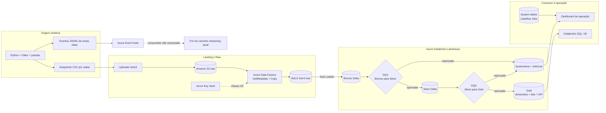
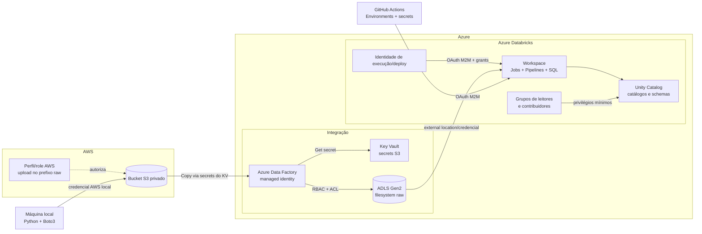
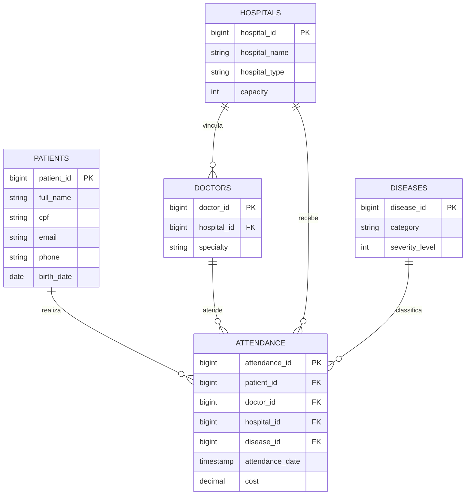
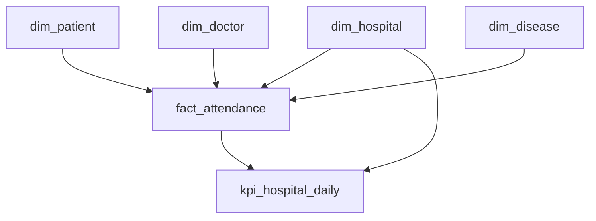

# Data Master - HealthLake

Plataforma de engenharia de dados para o domínio de saúde, construída com Python, Amazon S3, Azure Data Factory, Azure Data Lake Storage Gen2 e Azure Databricks. O projeto modela e versiona os componentes de um fluxo batch em arquitetura Lakehouse Medallion, da geração de dados sintéticos até produtos analíticos na camada Gold, além de um produtor experimental de eventos para Azure Event Hubs.

> [!NOTE]
> `HealthLake` é o nome deste projeto acadêmico. A solução não utiliza o serviço AWS HealthLake.

> [!IMPORTANT]
> Os registros são sintéticos e existem para demonstração técnica. Eles não devem ser interpretados como dados clínicos reais. O repositório contém os componentes do fluxo, mas ainda possui dependências externas e limitações conhecidas que impedem afirmar que um clone limpo executa o case inteiro sem preparação. Essas limitações e o plano para eliminá-las estão documentados de forma explícita.

## Sumário

1. [**Objetivo do Case**](#1-objetivo-do-case)
2. [**Arquitetura de Solução e Arquitetura Técnica**](#2-arquitetura-de-solução-e-arquitetura-técnica)
3. [**Explicação sobre o Case Desenvolvido**](#3-explicação-sobre-o-case-desenvolvido)
4. [Guia de configuração e execução](#4-guia-de-configuração-e-execução)
5. [Cobertura dos requisitos](#5-cobertura-dos-requisitos)
6. [**Melhorias e Considerações Finais**](#6-melhorias-e-considerações-finais)
7. [Referências](#7-referências)

---

## 1. **Objetivo do Case**

### 1.1 Contexto

O desafio solicita uma solução de engenharia de dados capaz de tratar volume, velocidade e variedade, cobrindo **Extração de Dados**, **Ingestão de Dados**, **Armazenamento de Dados**, **Observabilidade**, **Segurança de Dados**, **Mascaramento de Dados**, **Arquitetura de Dados**, **Escalabilidade** e **Reprodutibilidade da Arquitetura**.

O tema escolhido é saúde. A plataforma simula hospitais, pacientes, médicos, doenças, atendimentos e sinais vitais, preserva os dados brutos em um data lake, aplica controles de qualidade e publica um modelo analítico com indicadores operacionais por hospital.

### 1.2 Objetivos técnicos

- Gerar snapshots sintéticos em CSV, particionados por data lógica (`odate`), com seed, churn e anomalias controladas.
- Demonstrar diferentes formatos e velocidades com CSV batch e JSONL de eventos.
- Transportar o batch do Amazon S3 para o ADLS Gen2 por meio do Azure Data Factory (ADF).
- Organizar o processamento em Raw, Bronze, Silver e Gold, seguindo o padrão Medallion.
- Usar Apache Spark Declarative Pipelines (SDP), Lakeflow Pipelines e Delta Lake para processamento distribuído e tabelas transacionais.
- Bloquear promoções de camada quando regras críticas de qualidade falharem, mantendo métricas e quarentena.
- Reduzir a exposição de identificadores diretos antes do consumo analítico (`PIIs`).
- Governar acessos por grupos e privilégios do Unity Catalog.
- Versionar jobs, pipelines, dashboard e recursos Databricks com Declarative Automation Bundles.

### 1.3 Perguntas de negócio atendidas pela Gold

A tabela `kpi_hospital_daily` permite responder, por hospital e dia:

- Quantos atendimentos foram realizados?
- Qual foi o tempo médio de espera?
- Qual foi o custo total registrado?
- Qual foi a taxa de alta entre atendimentos cuja flag é conhecida?
- Como esses indicadores variam por tipo de hospital, estado e cidade?

### 1.4 Escopo e não escopo

| Dentro do escopo versionado | Fora do escopo atual |
| --- | --- |
| Geração sintética batch e de eventos | Prontuário eletrônico ou interoperabilidade FHIR |
| Upload batch para S3 | Uso do serviço AWS HealthLake |
| Cópia S3 -> ADLS pelo ADF | Provisionamento completo da infraestrutura cloud |
| Bronze, Silver, Gold e gates DQX | Consumidor de Event Hubs até Bronze/Gold |
| Unity Catalog, dashboard e CI/CD Databricks | Certificação formal de conformidade com a LGPD |
| Ambientes lógicos `dev` e `prod` no Bundle | Teste de carga e dimensionamento produtivo comprovado |

### 1.5 Estado resumido

| Capacidade | Estado no repositório | Observação |
| --- | --- | --- |
| Fluxo batch local -> S3 -> ADLS | Componentes versionados | Upload e ADF são disparados separadamente; recursos cloud precisam existir |
| Raw -> Bronze -> Silver -> Gold | Componentes versionados | Regex de `odate`, gate por partição e promoção fail-closed implementados; o bootstrap e a infraestrutura cloud ainda exigem preparação |
| Streaming | Parcial | Gera JSONL e envia ao Event Hubs; não há consumidor downstream |
| Qualidade e quarentena | Versionado | `clean` permite a trilha de aprovação; `chaos` continua como default para demonstrar quarentena; os gates operam em modo fail-closed |
| Governança | Política versionada | O SQL de grants precisa ser aplicado manualmente |
| CI/CD | Parcial | Executa testes do gerador e validate/deploy do Databricks; ainda não há smoke test cloud end-to-end |
| Infraestrutura como código | Parcial | O Bundle cobre recursos do workspace Databricks, não S3, ADF, ADLS, Key Vault ou Event Hubs |

---

## 2. **Arquitetura de Solução e Arquitetura Técnica**

### 2.1 Visão da solução



O caminho contínuo está desenhado separadamente porque hoje termina no Event Hubs. Portanto, o fluxo efetivamente documentado até a Gold é o batch.

### 2.2 Arquitetura técnica, identidades e limites



O repositório declara a factory e sua managed identity, os artefatos ADF, o Bundle Databricks e as políticas SQL para grupos humanos. Bucket, storage, cofre, rede, credenciais/external locations, grupos e privilégios da identidade de execução são fundação externa; não devem ser inferidos como provisionados pelo código atual.

### 2.3 Fluxo técnico end-to-end

| Etapa | Entrada | Processamento | Saída e controle |
| --- | --- | --- | --- |
| 1. Geração | Configuração e `id_control.json` | Faker/pandas criam registros, aplicam churn, nulos e duplicatas | CSV em `output/raw/odate=...` |
| 2. Landing AWS | Partição CSV local | `boto3.upload_file` envia os cinco datasets | `s3://<bucket>/raw/<dataset>/odate=<data>/<dataset>.csv` |
| 3. ADF | Parâmetros `odate`, bucket e datasets | `ForEach` paralelo verifica `exists`; `Copy` preserva hierarquia | `abfss://raw@<storage>/<dataset>/odate=<data>/<dataset>.csv` |
| 4. Bronze | CSVs no ADLS | Auto Loader faz leitura incremental e adiciona metadados | Cinco tabelas Delta Bronze |
| 5. Gate 1 | Uma `odate` das tabelas Bronze | Filtra a partição, limpa/deduplica/tipa e então aplica DQX | Métricas, quarentena `_v2`, aprovação conjunta das cinco tabelas ou bloqueio total |
| 6. Silver | Bronze aprovada | Snapshot atual, deduplicação, tipagem, padronização e máscaras | Cinco materialized views Silver |
| 7. Gate 2 | Uma `odate` das views Silver | Revalidação tipada antes do produto analítico | Métricas, quarentena `_v2`, aprovação conjunta ou bloqueio total |
| 8. Gold | Silver aprovada | Modelagem dimensional e agregação diária | Quatro dimensões, um fato e um KPI |
| 9. Consumo | Gold e métricas DQ | SQL Warehouse e dashboard AI/BI | Consultas analíticas e painel operacional |

### 2.4 Componentes e justificativas

| Componente | Papel | Justificativa | Trade-off |
| --- | --- | --- | --- |
| Python, Faker, NumPy e pandas | Fonte sintética | Baixo custo para reproduzir entidades relacionais, distribuições e casos inválidos | Não substitui uma fonte real nem simula perfeitamente comportamento clínico |
| Amazon S3 | Landing externa | Demonstra integração multicloud e desacopla a geração da plataforma Azure | Acrescenta custo, credenciais e um salto de rede |
| Azure Data Factory | Orquestração da cópia | Conector nativo S3/ADLS, paralelismo, retries e histórico de execução | O pipeline atual é manual e não dispara o Databricks |
| ADLS Gen2 | Zona Raw | Armazenamento de objetos escalável, hierárquico e integrado ao Azure | RBAC, ACLs, rede e lifecycle precisam ser configurados fora deste repositório |
| Azure Databricks | Processamento distribuído | Spark, Lakeflow, Delta Lake, Jobs, SQL e governança na mesma plataforma | Custo e dependência do workspace; requer Unity Catalog preparado |
| Delta Lake | Bronze, Silver e Gold | Transações ACID, schema enforcement e histórico transacional | Exige governança de retenção, otimização e custos de storage/compute |
| DQX | Gates de qualidade | Regras declarativas, split entre válidos/inválidos e quarentena | Projeto Databricks Labs, sem SLA formal; a dependência está fixada em `0.15.0` para builds reprodutíveis |
| Unity Catalog | Governança | Controle hierárquico por catálogo/schema, grupos e privilégios mínimos | Grupos, storage credentials e grants não são provisionados pelo Bundle atual |
| Declarative Automation Bundles | Recursos Databricks como código | Versiona pipelines, jobs, warehouse e dashboard por ambiente | Não provisiona toda a fundação AWS/Azure do case |
| Azure Event Hubs | Demonstração streaming | Serviço particionado e compatível com produção em lotes de eventos | Falta o consumidor, checkpoint e produto analítico contínuo |

### 2.5 Escolha de **Armazenamento de Dados**

A solução usa três níveis de **Armazenamento de Dados**, cada um com responsabilidade distinta:

| Tecnologia | Uso no case | Volume, velocidade e variedade | Por que não concentrar tudo aqui |
| --- | --- | --- | --- |
| S3 | Landing temporária do produtor batch | Bom para arquivos e crescimento horizontal | Não é a camada governada principal do workspace Azure |
| ADLS Gen2 | Arquivos Raw entregues pelo ADF | Adequado para CSVs particionados e futura variedade de formatos | O repositório não aplica imutabilidade, versionamento ou retenção; arquivo puro também não oferece sozinho semântica analítica ou ACID |
| Delta Lake no Databricks | Tabelas Bronze, Silver e Gold | Une storage de objetos com transações, schema e processamento Spark | Requer compute e governança Databricks |

Um banco relacional seria apropriado para transações operacionais e consultas seletivas, mas menos flexível como landing de arquivos e histórico bruto em grande escala. Um data warehouse dedicado seria uma alternativa para servir BI com alta concorrência; neste case, a Gold no Lakehouse reduz movimentações e atende o escopo analítico. On-premises não foi escolhido porque exigiria capacidade, alta disponibilidade, atualização e expansão administradas pelo próprio time. A opção cloud facilita expansão sob demanda, desde que custos, identidade e rede sejam governados.

### 2.6 Modelo lógico do domínio



As relações representam o desenho lógico; PKs e FKs não são declaradas nem impostas no storage atual. O perfil `clean` reconcilia referências básicas dos dados gerados, mas o gate DQ ainda não executa anti-joins entre todas as tabelas para impor integridade referencial sobre qualquer fonte externa; essa lacuna permanece nas limitações.

### 2.7 Organização do repositório

```text
.
|-- .github/workflows/        # CI e deploy do Bundle para dev/prod
|-- adf/
|   |-- factory/              # Factory e identidade gerenciada
|   |-- linkedService/        # S3, Key Vault e ADLS
|   |-- dataset/              # Datasets binários parametrizados
|   `-- pipeline/             # Cópia batch S3 -> ADLS
|-- data-generator/
|   |-- config/               # Volumes e perfis de qualidade
|   |-- generators/           # Entidades batch e eventos
|   |-- ingestion-s3/         # Uploader boto3
|   |-- metadata/             # Controle incremental de IDs
|   |-- producers/            # Produtor Event Hubs
|   |-- tests/                # Contratos dos perfis clean/chaos
|   `-- utils/                # Snapshot, churn, saneamento, arquivos e anomalias
|-- databricks/
|   |-- resources/            # Pipelines, Jobs, DQ, warehouse e dashboard
|   |-- src/bronze/           # Auto Loader
|   |-- src/silver/           # Tipagem, snapshot atual e máscaras
|   |-- src/gold/             # Dimensões, fato e KPI
|   |-- src/dq/               # Gates DQX, quarentena e métricas
|   |-- src/governance/       # Grants do Unity Catalog
|   `-- databricks.yml        # Bundle e targets
|-- sample_data/              # Amostras versionadas; não são bootstrap automático
`-- README.md
```

---

## 3. **Explicação sobre o Case Desenvolvido**

### 3.1 Dados e granularidade

| Dataset | Granularidade | Chave | Principais atributos | Classificação |
| --- | --- | --- | --- | --- |
| `patients` | Um paciente no snapshot | `patient_id` | nome, CPF, e-mail, telefone, sexo, tipo sanguíneo, nascimento, localidade | Identificadores diretos e dados pessoais/sensíveis |
| `hospitals` | Um hospital no snapshot | `hospital_id` | nome, tipo, cidade, UF, capacidade | Cadastro institucional |
| `doctors` | Um médico no snapshot | `doctor_id` | nome, CRM, especialidade, hospital | Dados pessoais profissionais e vínculo institucional |
| `diseases` | Uma doença no snapshot | `disease_id` | nome, categoria, severidade | Classificação de saúde |
| `attendance` | Um atendimento | `attendance_id` | paciente, médico, hospital, doença, espera, custo, severidade e alta | Evento assistencial sensível |
| `streaming_events` | Uma medição simulada | `event_id` | paciente, frequência cardíaca, oxigenação, temperatura e pressão | Telemetria sensível |

<details>
<summary>Dicionário físico dos arquivos de origem</summary>

| Dataset | Colunas |
| --- | --- |
| `patients.csv` | `patient_id`, `full_name`, `cpf`, `email`, `phone`, `gender`, `blood_type`, `birth_date`, `city`, `state`, `created_at` |
| `hospitals.csv` | `hospital_id`, `hospital_name`, `hospital_type`, `state`, `city`, `capacity`, `created_at` |
| `doctors.csv` | `doctor_id`, `doctor_name`, `crm`, `specialty`, `hospital_id`, `created_at` |
| `diseases.csv` | `disease_id`, `disease_name`, `category`, `severity_level`, `created_at` |
| `attendance.csv` | `attendance_id`, `patient_id`, `doctor_id`, `hospital_id`, `disease_id`, `attendance_date`, `wait_time_minutes`, `cost`, `severity_score`, `discharge_flag`, `created_at` |
| `streaming_events_*.jsonl` | `event_id`, `patient_id`, `heart_rate`, `oxygen_level`, `temperature`, `blood_pressure_systolic`, `blood_pressure_diastolic`, `event_timestamp` |

</details>

Os cinco CSVs de `sample_data/` têm 41 registros cada, além do cabeçalho, e o JSONL tem 100 eventos. As amostras contêm nulos e duplicatas para inspeção de qualidade, mas nenhum código as carrega automaticamente.

### 3.2 **Extração de Dados** e geração sintética

O ponto de entrada é [`data-generator/main.py`](data-generator/main.py). Em modo batch, cada `odate` representa uma fotografia completa:

1. O gerador procura a partição anterior mais recente.
2. Remove aleatoriamente uma fração configurada de registros para simular churn.
3. Gera novos IDs a partir de [`id_control.json`](data-generator/metadata/id_control.json).
4. No perfil default `chaos`, injeta nulos e duplicatas segundo [`settings.py`](data-generator/config/settings.py); no perfil `clean`, não injeta novas anomalias.
5. Concatena registros retidos e novos.
6. Em `clean`, saneia também os registros retidos: preserva o contrato de colunas, normaliza campos, remove obrigatórios inválidos, deduplica chaves e reconcilia as referências de atendimentos com as dimensões presentes.
7. Grava cada CSV por arquivo temporário e rename, reduzindo o risco de arquivo individual incompleto.
8. Avança o controle de IDs somente depois de salvar todos os snapshots.

Configuração versionada de novos registros por execução:

| Dataset | Novos registros |
| --- | ---: |
| Pacientes | 150 |
| Hospitais | 0 |
| Médicos | 2 |
| Doenças | 0 |
| Atendimentos | 2.500 |

A CLI aceita `--profile clean|chaos`. Use `clean` para uma execução destinada à Gold e uma `odate` separada com `chaos` para demonstrar o bloqueio. A seed configura os geradores pseudoaleatórios (PRNGs) de `random`, NumPy e Faker. Isso melhora a repetibilidade, mas não garante sozinho uma reprodução byte a byte: o resultado também depende da versão das bibliotecas, do relógio usado por `end_date="now"`, do estado de IDs e dos snapshots anteriores. A própria documentação do Faker restringe a garantia à mesma versão. A opção `--overwrite` substitui arquivos da partição, mas também gera novos dados e avança novamente os IDs; ela não funciona como replay idempotente. Como o mesmo caminho é reutilizado e o Auto Loader não habilita `cloudFiles.allowOverwrites`, essa sobrescrita normalmente também não atualiza a Bronze depois que o arquivo já foi descoberto.

No modo de eventos, o gerador cria um JSON por linha com sinais vitais e pode enviá-lo ao Event Hubs. O produtor respeita o tamanho máximo do lote: quando um evento não cabe, envia o lote atual e inicia outro.

### 3.3 **Ingestão de Dados** batch

#### 3.3.1 Upload para o S3

[`upload_to_s3.py`](data-generator/ingestion-s3/upload_to_s3.py) valida `odate`, exige uma partição local com CSVs e usa a cadeia padrão de credenciais do Boto3. Cada arquivo é enviado para:

```text
s3://<bucket>/raw/<dataset>/odate=<YYYY-MM-DD>/<dataset>.csv
```

O upload é sequencial e não grava manifest ou marcador de conclusão. Em produção, um manifest contendo quantidade, tamanho e checksum permitiria ao orquestrador rejeitar partições parciais.

#### 3.3.2 S3 para ADLS com ADF

O pipeline [`pl_copy_s3_to_adls_raw`](adf/pipeline/pl_copy_s3_to_adls_raw.json) recebe:

| Parâmetro | Tipo | Finalidade |
| --- | --- | --- |
| `odate` | string | Partição lógica obrigatória |
| `s3_bucket_name` | string | Bucket de origem |
| `dataset_names` | array | Lista de cinco datasets, com default versionado |

Para cada dataset, o ADF:

- executa `GetMetadata` para verificar `exists`;
- falha com `S3_RAW_FILE_NOT_FOUND` quando o objeto esperado não existe;
- copia o arquivo como binário, sem transformação;
- preserva a estrutura `<dataset>/odate=<data>/<dataset>.csv`;
- permite até cinco iterações paralelas (`batchCount: 5`);
- tenta novamente a cópia duas vezes, com intervalo de 60 segundos.

As chaves do S3 são referenciadas pelos secrets `aws-s3-access-key-id` e `aws-s3-secret-access-key` no Azure Key Vault. O repositório não armazena seus valores.

O pipeline mantém a anotação histórica `manual`, mas o repositório contém o
artefato `adf/trigger/trigger_case.json`, que declara uma cópia mensal no dia 05
e deriva a `odate` do horário agendado no fuso de São Paulo. Os workflows atuais
não publicam `adf/**` e a factory de desenvolvimento auditada não possui trigger
implantado. Além disso, o artefato local ainda não inicia o Job Databricks;
portanto, a passagem ADF -> Databricks continua exigindo uma ação separada do
operador.

### 3.4 **Ingestão de Dados** streaming

O caminho opcional gera JSONL local e, com `--send-eventhub`, publica uma quantidade finita definida por `--stream-count` no Azure Event Hubs por connection string. Essa parte demonstra um produtor experimental para um endpoint de streaming, não uma fonte contínua nem uma arquitetura Kappa ou Lambda completa: não há loop com pacing, consumidor Spark, checkpoint, Bronze streaming, reconciliação com o batch ou marts de sinais vitais.

Para produção, a autenticação deve migrar de connection string para identidade Microsoft Entra (`DefaultAzureCredential`), com o papel mínimo `Azure Event Hubs Data Sender`. Partições, throughput units, retenção, consumer groups e auto-inflate devem ser dimensionados por teste de carga. O produtor também precisa de idempotência: hoje o metadata de `event_id` só avança após todo o envio; se lotes iniciais forem aceitos e um lote posterior falhar, uma nova tentativa pode reutilizar IDs.

### 3.5 Camada Raw

A Raw no ADLS preserva os bytes copiados do S3:

```text
abfss://raw@<storage-account>.dfs.core.windows.net/
|-- patients/odate=YYYY-MM-DD/patients.csv
|-- hospitals/odate=YYYY-MM-DD/hospitals.csv
|-- doctors/odate=YYYY-MM-DD/doctors.csv
|-- diseases/odate=YYYY-MM-DD/diseases.csv
`-- attendance/odate=YYYY-MM-DD/attendance.csv
```

Essa zona permite auditoria e reprocessamento somente enquanto os objetos originais forem preservados. Ela é tratada conceitualmente como append-only, mas o uploader e o ADF podem substituir o mesmo caminho. Políticas de imutabilidade, versionamento, lifecycle e retenção são recomendações de produção e não estão declaradas no repositório.

### 3.6 Camada Bronze

[`ingestion.py`](databricks/src/bronze/ingestion.py) usa `spark.readStream.format("cloudFiles")` para ler incrementalmente os cinco diretórios. A configuração:

- interpreta CSV com cabeçalho UTF-8;
- infere tipos;
- usa `schemaEvolutionMode = rescue`;
- envia incompatibilidades para `_rescued_data`;
- registra `_source_file` e `_ingested_at`;
- extrai `odate` do segmento completo `odate=YYYY-MM-DD` com regex validado;
- usa `expect_or_fail` para interromper a atualização inteira quando o path não fornece uma `odate` válida;
- monitora chaves ausentes com expectations sem descartar silenciosamente a linha antes da limpeza e do DQ.

| Tabela Bronze | Origem Raw | Chave monitorada |
| --- | --- | --- |
| `bronze.patients` | `raw/patients` | `patient_id` |
| `bronze.hospitals` | `raw/hospitals` | `hospital_id` |
| `bronze.doctors` | `raw/doctors` | `doctor_id` |
| `bronze.diseases` | `raw/diseases` | `disease_id` |
| `bronze.attendance` | `raw/attendance` | `attendance_id` |

O Auto Loader mantém estado de ingestão e evita reler arquivos já processados dentro do checkpoint gerenciado pelo Lakeflow. A Bronze é histórica e recebe snapshots completos de várias datas. Como `cloudFiles.allowOverwrites` não está configurado, o desenho seguro é publicar um caminho imutável por execução; replay no mesmo path exige política explícita de overwrite, deduplicação e reconciliação.

### 3.7 Gate de qualidade Bronze -> Silver

O Job DQX recebe uma `odate` explícita, filtra somente essa partição em cada tabela Bronze e falha se qualquer uma das cinco entidades não tiver linhas. Antes de aplicar regras, ele usa as mesmas transformações puras da Silver para deduplicar, tipar, normalizar e mascarar os dados. Essa limpeza também remove registros incompletos em campos não-chave antes do DQ; a reconciliação fica registrada como `removed_by_cleaning = input_rows - checked_rows` dentro de `violation_summary`. Só então o DQX divide linhas válidas e inválidas, mascara PII de pacientes na quarentena `_v2` e grava métricas em `<catalog>.observability.dq_run_metrics`. O sufixo `_v2` separa o schema tipado pós-limpeza das quarentenas raw legadas, incompatíveis para `mergeSchema`.

| Entidade | Regras principais |
| --- | --- |
| Pacientes | ID presente/único, nascimento não futuro, sexo `M/F`, UF com duas letras |
| Hospitais | ID presente/único, capacidade entre 1 e 2.000, UF válida |
| Médicos | ID presente/único, CRM positivo, hospital presente |
| Doenças | ID presente/único, severidade entre 1 e 5 |
| Atendimentos | ID e FKs presentes, data não futura, espera 0-300, custo não negativo, severidade 1-5, alta 0/1 |

Depois da limpeza, qualquer violação restante gera status `FAILED`, persiste a quarentena e lança erro para impedir a Silver; nenhuma fração válida da tabela é promovida. O split válido nunca é salvo diretamente. Somente quando as cinco tabelas passam o Job atualiza `<catalog>.observability.dq_promotion_control`; esse é o único sinal consumido pela Silver. Assim, as cinco tabelas são promovidas juntas ou nenhuma é atualizada. O perfil `clean` sustenta o caminho de sucesso, enquanto `chaos` demonstra deliberadamente quarentena e bloqueio.

### 3.8 Camada Silver

[`transforms.py`](databricks/src/silver/transforms.py) trata cada `odate` como snapshot completo e lê apenas a data aprovada para `bronze_to_silver` em `dq_promotion_control`. O módulo compartilhado [`cleaning.py`](databricks/src/silver/cleaning.py) repete deterministicamente a mesma deduplicação, tipagem e normalização validadas pelo gate. Expectations `expect_or_fail` interrompem a materialização inteira se o contrato de qualquer view for violado.

| View Silver | Transformações relevantes |
| --- | --- |
| `patients_current` | Tipagem, trim/uppercase e máscaras de nome, CPF, e-mail e telefone |
| `hospitals_current` | Capacidade inteira, UF uppercase e textos normalizados |
| `doctors_current` | CRM/IDs bigint, textos normalizados |
| `diseases_current` | Severidade inteira e textos normalizados |
| `attendance_current` | Timestamp/data, custo `decimal(12,2)`, severidade inteira e flag booleana |

As views mantêm `snapshot_date`, `_source_file` e `_ingested_at` para rastreabilidade. O modelo tem semântica de current snapshot análoga a SCD Type 1, sem implementar uma dimensão SCD por `MERGE`; não mantém histórico dimensional Type 2.

### 3.9 **Mascaramento de Dados** e minimização

Os identificadores diretos recebem máscaras de apresentação ao entrar na Silver e antes de uma linha de paciente ser gravada na quarentena:

| Campo | Forma resultante | Exemplo conceitual |
| --- | --- | --- |
| `full_name` | Primeira letra + `***` | `M***` |
| `cpf` | Apenas dois últimos dígitos visíveis | `***.***.***-42` |
| `email` | Primeira letra + domínio | `m***@example.com` |
| `phone` | Apenas quatro últimos dígitos | `***-1234` |

A Gold exclui nome, CPF, e-mail e telefone da dimensão de pacientes. Ainda assim, isso é minimização e redação de identificadores, não prova de anonimização: `patient_id`, localização, nascimento, eventos assistenciais e combinações de atributos podem permitir reidentificação. A dimensão de médicos também mantém `doctor_name`. Portanto, a Gold não é livre de dados pessoais nem anônima; Raw e Bronze mantêm PII integral para finalidades técnicas controladas. Uma avaliação formal deve considerar base legal, finalidade, necessidade, retenção, risco de reidentificação, direitos do titular e controles organizacionais.

### 3.10 Gate de qualidade Silver -> Gold

O segundo gate filtra as views tipadas pela mesma `odate` recebida pelo Job e repete verificações essenciais:

- chaves presentes e únicas;
- `snapshot_date` presente para pacientes;
- capacidade hospitalar válida;
- vínculos obrigatórios presentes;
- data de atendimento presente;
- custo não negativo;
- severidade dentro do domínio.

Apenas quando as cinco views passam o controle de promoção de `silver_to_gold` é atualizado e o Job executa a Gold. A fact usa `expect_or_fail` para que uma data de atendimento ausente aborte a atualização inteira, em vez de salvar uma tabela parcialmente filtrada.

### 3.11 Camada Gold

[`marts.py`](databricks/src/gold/marts.py) publica um esquema estrela:



| Produto | Grão | Conteúdo |
| --- | --- | --- |
| `dim_patient` | Um paciente atual | Sexo, tipo sanguíneo, nascimento, cidade, UF e data do snapshot; sem nome, CPF, e-mail e telefone, mas ainda com `patient_id` e quasi-identificadores |
| `dim_hospital` | Um hospital atual | Nome, tipo, localidade, capacidade e snapshot |
| `dim_doctor` | Um médico atual | Nome, especialidade, hospital e snapshot |
| `dim_disease` | Uma doença atual | Nome, categoria, severidade e snapshot |
| `fact_attendance` | Um atendimento | Chaves dimensionais, data/hora, espera, custo, severidade, alta e snapshot |
| `kpi_hospital_daily` | Um hospital por dia | Quantidade, espera média, custo total e taxa de alta, enriquecidos com o hospital |

Fórmulas do KPI:

- `attendance_count = count(attendance_id)`
- `avg_wait_time_minutes = avg(wait_time_minutes)`
- `total_cost = sum(cost)`
- `discharge_rate = avg(cast(is_discharged as double))`; como `avg` ignora nulos, o denominador contém somente atendimentos cuja flag de alta é conhecida

### 3.12 **Segurança de Dados**

Controles presentes no código e na configuração:

| Camada | Controle |
| --- | --- |
| S3 -> ADF | Chaves referenciadas no Key Vault, sem valores no Git |
| ADF | Factory declara managed identity system-assigned |
| ADLS | Endpoint separado para Raw; autorização deve ser configurada por RBAC/ACL fora do Git |
| Databricks | OAuth M2M nos workflows e separação de catálogos `healthlake_dev`/`healthlake_prod` |
| Unity Catalog | Grants por grupos, sem grants diretos a pessoas no SQL versionado |
| Silver/Gold | Máscaras e exclusão de nome, CPF, e-mail e telefone de pacientes na Gold; outros dados pessoais e quasi-identificadores permanecem |
| GitHub Actions | Secrets e variables por Environment; produção pode exigir aprovação |

Matriz humana declarada em [`unity_catalog_access.sql`](databricks/src/governance/unity_catalog_access.sql):

| Grupo | Dev Bronze | Dev Silver | Dev Gold | Prod Bronze | Prod Silver | Prod Gold |
| --- | --- | --- | --- | --- | --- | --- |
| `data-engineering-admin` | Leitura | Leitura | Leitura | Leitura | Leitura | Leitura |
| `data-engineering` | — | Leitura | Leitura | — | Leitura | Leitura |
| `data-analysts` | — | — | — | — | Leitura | Leitura |
| `data-scientists` | — | — | — | — | Leitura | Leitura |
| `power-bi` | — | — | — | — | Leitura | Leitura |

Todos os cinco são grupos humanos estritamente de leitura. O nome
`data-engineering-admin` representa o administrador funcional que pode
inspecionar todas as camadas; ele não recebe escrita, ownership, `MANAGE` nem
administração do workspace. Em dev, apenas os dois grupos de engenharia devem
ser atribuídos ao workspace. Em prod, os cinco devem ser atribuídos.

Escrita, execução de pipelines e deploy devem pertencer a identidades de
serviço dedicadas. O SQL acima não cria grupos, não gerencia seus membros, não
concede permissões de workspace/warehouse e não é executado automaticamente
pelo Bundle; esses itens são pré-requisitos administrativos separados.

Para uso real, também são necessários: bloqueio de acesso público, TLS obrigatório, criptografia em repouso validada, private endpoints/VNet, rotação de credenciais, logs de auditoria, política de retenção/expurgo, segregação de funções, resposta a incidentes e avaliação de impacto. O uso de serviços que criptografam por padrão não substitui a verificação da configuração efetiva.

#### LGPD

Dados de saúde são dados pessoais sensíveis segundo a Lei nº 13.709/2018. Este case usa dados sintéticos e demonstra controles técnicos, mas não comprova conformidade integral. Para uma implantação real, o controlador deve documentar finalidade e base legal, aplicar necessidade e minimização, estabelecer retenção, atender direitos dos titulares, gerenciar operadores, testar segurança e avaliar riscos de reidentificação. **Mascaramento de Dados** não deve ser apresentado como anonimização sem uma análise contextual robusta.

### 3.13 **Observabilidade**

| Sinal | Origem | Uso |
| --- | --- | --- |
| Existência do arquivo | ADF `GetMetadata` | Falha cedo quando a partição S3 está incompleta |
| Retries e status de cópia | ADF pipeline run | Diagnóstico de ingestão e conectividade |
| `_source_file`, `_ingested_at`, `snapshot_date` | Bronze/Silver | Rastreabilidade de arquivo e tempo |
| Expectation metrics | Lakeflow | Contagem de violações e falhas transacionais por `expect_or_fail` |
| `dq_run_metrics` | DQX | `odate`, `input_rows`, `checked_rows`, `removed_by_cleaning` em `violation_summary`, válidos, quarentena, status, tabela e run ID |
| `dq_promotion_control` | DQX/Silver | Única `odate` aprovada por estágio, atualizada somente depois que as cinco tabelas passam |
| Tabelas de sistema `system.lakeflow.*` | Databricks | Histórico de jobs e última execução bem-sucedida |
| Notificação por e-mail | Jobs DQX | Alerta de falha do gate |
| Dashboard AI/BI | SQL Warehouse | Resultados DQ por tabela/estágio, linhas em quarentena e consultas de execuções |

O dashboard seleciona o `workspace_id` de dev ou prod a partir do catálogo corrente, considera somente versões atuais de jobs (`delete_time IS NULL`) e usa o estado `SUCCEEDED` registrado pela system table. Os contadores DQ representam resultados por tabela e estágio em `dq_run_metrics`, não gates completos. O painel ainda não mede freshness ponta a ponta, atraso S3/ADF/Auto Loader, throughput do Event Hubs, custo, SLA/SLO ou reconciliação de contagens entre as camadas.

### 3.14 **Escalabilidade**

Mecanismos existentes:

- ADF processa os cinco datasets em paralelo (`isSequential: false`, `batchCount: 5`).
- Auto Loader descobre arquivos incrementalmente e mantém checkpoint gerenciado.
- Lakeflow Pipelines usa compute serverless e execução acionada, evitando cluster permanente.
- O produtor Event Hubs agrupa eventos até o limite do lote.
- A fila dos Jobs evita descartar uma nova run quando o limite de concorrência é atingido; os jobs dos gates DQ limitam `max_concurrent_runs` a 1.
- O SQL Warehouse é serverless, Photon e 2X-Small, com auto-stop de 10 minutos.

Estratégias para crescimento:

| Dimensão | Horizontal | Vertical |
| --- | --- | --- |
| Cópia batch | Mais datasets/arquivos em paralelo e Integration Runtime scale-out | Mais Data Integration Units (DIUs) por Copy Activity |
| Spark/Lakeflow | Particionamento de arquivos, mais tarefas e serverless autoscaling | Workers maiores quando o gargalo for memória/CPU por tarefa |
| Event Hubs | Mais partições e consumidores independentes | Mais throughput/processing units e auto-inflate |
| SQL | Mais clusters concorrentes | Warehouse maior |

O case ainda não comprova capacidade de grande volume por teste de carga. O DQX agora filtra a partição-alvo antes da limpeza e das janelas de unicidade, evitando calcular sobre toda a Bronze histórica. Ainda é necessário medir e reduzir ações Spark repetidas dentro dessa partição, compactar arquivos pequenos e definir metas mensuráveis de volume, latência, custo e disponibilidade.

### 3.15 CI/CD e ambientes

| Workflow | Gatilho | Ações |
| --- | --- | --- |
| `ci.yml` | Push/PR em `develop` ou `main` | Python 3.11, dependências, pytest, compileall e `bundle validate` dev; depois de um push aprovado em `main`, chama o deploy produtivo somente se todo o CI passar |
| `deploy-dev.yml` | Push em `develop` com mudança em `databricks/**` ou `.github/workflows/**`, ou execução manual | Valida e faz deploy do target `dev` |
| `deploy-prod.yml` | Chamado automaticamente pelo CI de `main`, ou manualmente | Checkout do SHA aprovado, valida, planeja e faz deploy do target `prod`; batch só executa por chamada manual com opt-in e `odate` |

Os deploys usam OAuth M2M e GitHub Environments. Configure:

| Nome | Tipo | Ambiente |
| --- | --- | --- |
| `DATABRICKS_HOST` | Variable | Development e production |
| `DATABRICKS_CLIENT_ID` | Variable | Development e production |
| `DATABRICKS_CLIENT_SECRET` | Secret | Development e production |

O `CODEOWNERS` e a proteção de `main` formam o gate humano: somente PR aprovado pelo owner e com CI verde pode ser mesclado. O Environment `production` restringe a branch a `main`; adicionar um reviewer também nesse Environment cria um segundo gate manual e deixa o deploy aguardando aprovação. O workflow rejeita refs diferentes de `main`, faz checkout do SHA do próprio run e fixa as actions por commit. A Raw é versionada no Bundle como `abfss://raw@sthealthdatalake001.dfs.core.windows.net`; o catálogo `healthlake_prod` mantém seus dados gerenciados em `sthlkprodbrs01`.

O caller de produção usa `secrets: inherit` para disponibilizar os secrets ao workflow reutilizável. Antes da validação do Bundle, o workflow rejeita secret vazio e confirma a identidade OAuth com uma chamada de controle que não inicia compute.

O CI/CD atual executa os testes versionados e promove automaticamente o Bundle depois de um merge aprovado em `main`. Essa promoção não executa batch nem streaming. O processo ainda não provisiona cloud, não publica os artefatos ADF, não executa `unity_catalog_access.sql` e não faz smoke test end-to-end independente no workspace.

---

## 4. Guia de configuração e execução

### 4.1 Pré-requisitos

#### Máquina local

- Git.
- Python 3.11, igual ao CI.
- AWS CLI opcional para diagnóstico; o uploader usa Boto3.
- Azure CLI e a extensão `datafactory` para disparar/consultar o ADF por terminal, se desejado.
- Databricks CLI `>= 1.9.0`.
- Acesso de rede aos endpoints AWS/Azure.

#### Recursos externos já provisionados

O repositório não cria estes recursos:

- bucket S3 privado;
- Azure Key Vault;
- ADLS Gen2 com filesystem `raw`;
- Azure Data Factory com managed identity;
- Azure Event Hubs, apenas para a trilha opcional;
- workspace/região Azure Databricks com Unity Catalog e serverless habilitado para Lakeflow Pipelines, Jobs e SQL Warehouse;
- catálogos `healthlake_dev` e `healthlake_prod`;
- schemas `bronze`, `silver`, `gold`, `quarantine` e `observability`;
- storage credential/external location ou outra autorização governada para leitura do ADLS;
- grupos de conta/SCIM definidos no SQL de governança.

### 4.2 Clonar e preparar o Python

```powershell
git clone https://github.com/Ecardunk/data-master-healthlake.git
Set-Location .\data-master-healthlake

python -m venv .venv
.\.venv\Scripts\Activate.ps1
python -m pip install --upgrade pip
python -m pip install -r .\data-generator\requirements.txt
```

### 4.3 Variáveis locais

Crie `.env` na raiz. O arquivo é ignorado pelo Git.

```dotenv
S3_BUCKET_NAME=<bucket-privado>
AWS_REGION=<regiao-aws>

# Opcionais: somente para envio de eventos.
EVENTHUB_CONNECTION_STR=<connection-string>
EVENTHUB_NAME=<event-hub>
```

Não versione chaves. Para o Boto3, prefira perfil AWS, IAM Role ou credenciais temporárias. Se variáveis forem inevitáveis, use os nomes padrão reconhecidos pelo SDK e rotação frequente.

### 4.4 Preparar ADF, Key Vault e ADLS

1. Ajuste os endpoints específicos do ambiente nos linked services:
   - Key Vault em [`ls_keyvault_healthlake.json`](adf/linkedService/ls_keyvault_healthlake.json);
   - ADLS em [`ls_adls_healthlake.json`](adf/linkedService/ls_adls_healthlake.json).
2. Crie no Key Vault os secrets `aws-s3-access-key-id` e `aws-s3-secret-access-key`.
3. Dê à managed identity do ADF `Get/List` via access policy ou `Key Vault Secrets User` via RBAC.
4. Dê à identidade do ADF permissão mínima de escrita no filesystem `raw` por RBAC/ACL.
5. Dê às credenciais AWS de leitura do ADF `s3:GetObject` e `s3:GetObjectVersion` no prefixo do case. Para teste/browse no ADF Studio, a documentação do conector também lista `s3:ListAllMyBuckets`, `s3:ListBucket` e `s3:GetBucketLocation`; evite concedê-las quando a validação puder usar um caminho específico.
6. Publique os datasets, linked services e pipeline da pasta `adf/` pela integração Git do ADF Studio ou por um processo de deploy criado para o ambiente.

> [!NOTE]
> Para managed identity atribuída pelo sistema, o linked service ADLS documentado contém `type: AzureBlobFS` e `url`, como o JSON versionado. A execução ainda depende das permissões efetivas da managed identity do ADF: para o sink, configure `Write` + `Execute` por ACL ou o papel `Storage Blob Data Contributor`, com o escopo mínimo necessário.

### 4.5 Preparar Unity Catalog e Databricks

Antes do Bundle:

1. Crie os catálogos e schemas listados nos pré-requisitos.
2. Autorize a identidade de execução a ler o `raw_root` do ADLS.
3. Conceda a essa identidade `USE CATALOG`/`USE SCHEMA` e os privilégios necessários para criar, ler e escrever os objetos Bronze, Silver, Gold, `quarantine` e `observability`, além de usar o SQL Warehouse e administrar os recursos implantados. O SQL de grupos humanos não concede esses privilégios à identidade de serviço.
4. Crie/sincronize os grupos de conta.
5. Revise os nomes de catálogo no SQL e execute [`unity_catalog_access.sql`](databricks/src/governance/unity_catalog_access.sql) com uma identidade autorizada.
6. Troque o e-mail default de alerta `dq_alert_email`.
7. Confirme os `workspace_id` de dev/prod usados pelo dashboard.
8. Revise `raw_root`, host e nomes de storage em [`databricks.yml`](databricks/databricks.yml).

Os Jobs e Pipelines têm `run_as` explícito por ambiente: o service principal
`sp-healthlake-dev-pipeline` em dev e `sp-healthlake-prod-pipeline` em prod. Os
workflows autenticam via OAuth M2M; contas pessoais não são identidades de
execução. Prefira promover/deployar pelos workflows para manter uma única
instância do Bundle por ambiente.

Autenticação local de desenvolvimento:

```powershell
databricks auth login --host "<workspace-url>" --profile HEALTHLAKE_DEV
```

### 4.6 Atenção ao bootstrap de um clone limpo

No estado versionado, `id_control.json` contém IDs avançados, `hospitals` e `diseases` geram zero novos registros, e `data-generator/output/` não é versionado. Portanto, um clone limpo não possui os snapshots-base que justificam esses IDs. O perfil `clean` preserva os headers/contratos mesmo para datasets vazios e remove referências órfãs, mas não inventa os registros-base ausentes: sem snapshot anterior, hospitais e doenças continuam vazios e o gate fail-closed reprova a `odate`. `sample_data/` também não é usado automaticamente.

Antes da primeira carga reproduzível, implemente ou execute conscientemente uma destas opções:

1. Bootstrap limpo: zerar o metadata, configurar contagens positivas para as entidades-base e gerar o primeiro snapshot.
2. Seed controlada: carregar snapshots-base versionados/validados e alinhar o metadata ao maior ID.
3. Fixture de demonstração: publicar um conjunto pequeno e limpo diretamente no layout S3 esperado.

Depois de preparar uma base coerente, use `--profile clean` para a trilha até a Gold. O perfil saneia inclusive linhas retidas de snapshots anteriores. Use `--profile chaos` em outra `odate` para demonstrar o caminho esperado de falha/quarentena; `chaos` permanece como default por compatibilidade.

> [!CAUTION]
> O regex de `odate`, o gate DQ por partição, a limpeza antes das regras e os perfis `clean`/`chaos` já estão implementados. A sequência abaixo representa o caminho operacional no código, mas uma execução real ainda depende do bootstrap coerente, dos recursos/credenciais cloud e de registrar evidência da run no ambiente-alvo.

### 4.7 Gerar batch

```powershell
$odate = "2026-07-05"
python .\data-generator\main.py --odate $odate --seed 42 --profile clean
```

Saída esperada:

```text
data-generator/output/raw/odate=2026-07-05/
|-- patients.csv
|-- hospitals.csv
|-- doctors.csv
|-- diseases.csv
`-- attendance.csv
```

Para outra data, use um novo `odate`. Prefira um path/`odate` novo por execução. `--overwrite` avança o metadata, não reproduz a partição anterior e, após upload/cópia para o mesmo path, pode não atualizar a Bronze porque `cloudFiles.allowOverwrites` não está habilitado.

Para testar a quarentena, gere `--profile chaos` com uma segunda `odate`; não reutilize o path limpo.

### 4.8 Enviar a partição ao S3

```powershell
python .\data-generator\ingestion-s3\upload_to_s3.py --odate $odate
```

Valide se os cinco objetos existem antes de iniciar o ADF.

### 4.9 Executar o ADF

No ADF Studio, execute `pl_copy_s3_to_adls_raw` com `odate` e bucket. Via Azure CLI, instale explicitamente a extensão para evitar o prompt de instalação automática e selecione a assinatura:

```powershell
az extension add --name datafactory
az login
az account set --subscription "<subscription>"

az datafactory pipeline create-run `
  --resource-group "<resource-group>" `
  --factory-name "<data-factory>" `
  --name "pl_copy_s3_to_adls_raw" `
  --parameters '{"odate":"2026-07-05","s3_bucket_name":"<bucket>"}'
```

Só continue depois que a execução terminar com sucesso e os cinco arquivos estiverem no ADLS Raw.

### 4.10 Validar, publicar e executar o Bundle

```powershell
Push-Location .\databricks

databricks bundle validate --target dev --profile HEALTHLAKE_DEV
databricks bundle deploy --target dev --profile HEALTHLAKE_DEV
databricks bundle run healthlake_medallion_refresh `
  --target dev `
  --profile HEALTHLAKE_DEV `
  --params "odate=$odate"

Pop-Location
```

Ordem do Job:

```text
Bronze -> DQX Bronze/Silver -> Silver -> DQX Silver/Gold -> Gold
```

Se um gate falhar, o bloqueio é esperado. Consulte:

```sql
SELECT *
FROM healthlake_dev.observability.dq_run_metrics
WHERE odate = DATE '2026-07-05'
ORDER BY checked_at DESC;

SELECT *
FROM healthlake_dev.observability.dq_promotion_control
ORDER BY dq_stage;

SHOW TABLES IN healthlake_dev.quarantine LIKE '*_v2';
```

Em `dq_run_metrics`, `input_rows` é a quantidade filtrada da camada de origem para a `odate` e `checked_rows` é a quantidade efetivamente submetida às regras depois de limpeza e deduplicação. A diferença `removed_by_cleaning = input_rows - checked_rows`, registrada no JSON de `violation_summary`, contabiliza os registros incompletos em campos não-chave removidos antes do DQ. Depois dessa etapa, qualquer violação restante bloqueia o salvamento da tabela inteira; o controle de promoção só muda depois que as cinco entidades passam.

O parâmetro `odate` dos Jobs tem default vazio de propósito. Não existe fallback para a data do relógio: omitir `--params "odate=YYYY-MM-DD"` faz o gate falhar na validação do argumento, evitando processar acidentalmente a partição errada.

Quando os dois gates aprovarem, valide a Gold:

```sql
SELECT COUNT(*) AS attendance_rows
FROM healthlake_dev.gold.fact_attendance;

SELECT *
FROM healthlake_dev.gold.kpi_hospital_daily
ORDER BY attendance_date DESC, attendance_count DESC
LIMIT 20;
```

### 4.11 Gerar e enviar eventos opcionais

Execute este comando a partir da raiz do repositório. É necessário que `patient_id` no metadata seja maior que zero.

```powershell
python .\data-generator\main.py `
  --streaming `
  --stream-count 100 `
  --seed 42 `
  --send-eventhub
```

Sem `--send-eventhub`, o JSONL é gerado localmente. Com a opção, o envio termina no Event Hubs; não espere tabelas Bronze/Gold de streaming.

### 4.12 Deploy de produção

1. Proteja `main` para aceitar somente PR, exija o `CODEOWNER` e mantenha o Environment `production` restrito a `main`.
2. Configure `DATABRICKS_HOST`, `DATABRICKS_CLIENT_ID` e `DATABRICKS_CLIENT_SECRET` no Environment.
3. Depois da aprovação e merge em `main`, acompanhe o CI. Se todos os testes e a validação dev passarem, ele chama automaticamente validate, plan e deploy de produção para o mesmo SHA.
4. O deploy automático não executa dados e deixa o Warehouse de observabilidade parado.
5. Para o batch mensal, confirme os cinco arquivos da mesma `odate` na Raw e execute manualmente `Deploy production` com `run_batch_refresh=true` e a data `YYYY-MM-DD`.
6. Acompanhe o `healthlake_medallion_refresh` e execute os smoke tests funcionais.

### 4.13 Roteiro de demonstração

| Tempo | Demonstração |
| ---: | --- |
| 0-10 min | Problema, objetivo, dados sintéticos e requisitos |
| 10-25 min | Diagrama, escolhas tecnológicas e limites do escopo |
| 25-40 min | Geração, partição, S3 e execução ADF |
| 40-60 min | Bronze, gates DQX, Silver e Gold |
| 60-70 min | **Mascaramento de Dados**, **Segurança de Dados** e Unity Catalog |
| 70-80 min | **Observabilidade**, dashboard e **Escalabilidade** |
| 80-90 min | Limitações, roadmap e perguntas |

O roteiro usa duas partições imutáveis: uma gerada com `--profile clean` para chegar à Gold e outra, com `--profile chaos`, para demonstrar quarentena e bloqueio fail-closed. Os dois perfis estão implementados; registre separadamente a evidência cloud de sucesso e de falha esperada.

### 4.14 Evidências para a entrega e apresentação

Diagramas e código não substituem evidência de execução. O repositório não versiona capturas ou resultados cloud; para cada ambiente e `odate`, registre pelo menos:

| Etapa | Evidência mínima | Critério de aceite |
| --- | --- | --- |
| Geração | Log do comando, `odate`, seed, contagens e checksums | Cinco CSVs completos no path esperado |
| S3 | Listagem dos cinco objetos, tamanho e versão/checksum | Partição íntegra antes do ADF |
| ADF | Run ID e status das cinco cópias | Pipeline `Succeeded`, sem dataset ausente |
| Bronze | Contagens por `odate`, `_source_file` e violações de expectations | Linhagem e volume reconciliados com a Raw; `odate_present` sem falha |
| DQX | `dq_run_metrics`, `dq_promotion_control` e amostra da quarentena `_v2` para perfis clean/chaos | `removed_by_cleaning = input_rows - checked_rows` reconciliado; clean aprovado; qualquer violação remanescente no chaos bloqueia a tabela inteira |
| Silver/Gold | Run ID do Job, contagens e consulta de `kpi_hospital_daily` | Os dois gates aprovados e produtos Gold populados |
| Dashboard | Captura com horário, workspace e filtros visíveis | Métricas coerentes com a run demonstrada |

Não publique chaves, connection strings, nomes de pessoas reais ou identificadores de conta nas capturas. Vincule as evidências ao commit e ao `odate` executados para que a demonstração seja auditável.

### 4.15 Troubleshooting

| Sintoma | Verificação |
| --- | --- |
| `Partition not found` | Confirme o `odate` e a pasta em `data-generator/output/raw` |
| `S3_BUCKET_NAME environment variable is required` | Crie `.env` na raiz ou exporte a variável |
| `S3_RAW_FILE_NOT_FOUND` no ADF | Confirme todos os objetos e o layout exato no bucket |
| Erro de Key Vault | Verifique nomes dos secrets e acesso da managed identity |
| Bundle não autentica | Revise host/profile ou variables/secrets OAuth M2M |
| Gate DQX falha | Confirme o `--params "odate=YYYY-MM-DD"`, consulte `dq_run_metrics` para essa data e a tabela de quarentena com sufixo `_v2` |
| Silver vazia | Confirme que as cinco Bronze têm linhas na `odate` solicitada e que `dq_promotion_control` aprovou `bronze_to_silver`; linhas legadas com `odate` nula exigem nova partição imutável ou full refresh controlado |
| Dashboard sem jobs | Confirme o catálogo corrente, o `workspace_id` mapeado e o acesso às system tables; a consulta considera apenas `SUCCEEDED` e versões atuais não removidas |
| Testes do gerador falham | Execute `python -m pytest data-generator/tests -q` e revise o contrato dos perfis `clean`/`chaos` |

---

## 5. Cobertura dos requisitos

| Requisito do PDF | Evidência no case | Cobertura atual |
| --- | --- | --- |
| **Extração de Dados** | Faker/pandas, cinco snapshots CSV e eventos JSONL; diferentes distribuições e anomalias | Implementada com dados simulados |
| **Ingestão de Dados** | Boto3 -> S3; ADF batch S3 -> ADLS; produtor Event Hubs | Batch versionado e manual; streaming parcial |
| **Armazenamento de Dados** | S3 landing, ADLS Raw, Delta Bronze/Silver/Gold | Implementado nos artefatos; infraestrutura é externa |
| **Observabilidade** | Runs/retries do ADF, metadados de linhagem, métricas DQX, system tables, e-mail e dashboard | Parcial; falta visão ponta a ponta e SLO/freshness |
| **Segurança de Dados** | Key Vault, managed identity declarada, OAuth M2M, GitHub Environments e Unity Catalog | Parcial; rede, rotação, auditoria e infraestrutura não estão automatizadas |
| **Mascaramento de Dados** | Máscaras na Silver/quarentena e remoção de nome, CPF, e-mail e telefone de pacientes da Gold | Versionado como minimização; regex de dígitos corrigido; Gold ainda contém dados pessoais/quasi-identificadores e não equivale a anonimização |
| **Arquitetura de Dados** | Lakehouse Medallion, Spark distribuído, Delta e modelo estrela | Implementada no Bundle |
| **Escalabilidade** | ADF paralelo, Auto Loader, serverless, filas e Event Hubs em lotes | Mecanismos presentes; sem teste de carga ou dimensionamento comprovado |
| **Reprodutibilidade da Arquitetura** | Dependências pinadas do gerador, testes de perfis, JSON ADF, Bundle e workflows | Parcial; faltam bootstrap transacional, IaC cloud, deploy ADF e smoke test end-to-end |

---

## 6. **Melhorias e Considerações Finais**

### 6.1 Limitações conhecidas

| Prioridade | Limitação verificada | Impacto | Correção recomendada |
| --- | --- | --- | --- |
| P0 | Bootstrap depende de snapshots locais ignorados | O perfil `clean` preserva headers e elimina FKs órfãs, mas um clone sem registros-base produz dimensões vazias e o gate reprova a `odate` | Versionar fixture limpa ou criar comando transacional de bootstrap/reset |
| P1 | Sobrescrita reutiliza o path já descoberto | Auto Loader não habilita `cloudFiles.allowOverwrites`; Raw muda, mas Bronze pode não reprocessar | Usar paths imutáveis por execução ou desenhar replay com overwrite, checkpoint e deduplicação |
| P1 | O gate não impõe integridade referencial cruzada | O perfil `clean` reconcilia os dados gerados, mas uma fonte externa pode trazer FKs presentes que apontam para dimensões inexistentes | Adicionar anti-joins/regras DQ entre fatos e dimensões |
| P1 | ADF e Databricks não estão encadeados | Operação manual, risco de partição parcial | Criar trigger/orquestrador e manifest de conclusão |
| P1 | Infra cloud e governança-base não são IaC | **Reprodutibilidade da Arquitetura** incompleta | Adicionar Terraform/Bicep para AWS/Azure/Databricks e migrations de grants |
| P1 | Streaming termina no Event Hubs | Não há análise em tempo real | Criar consumer Lakeflow, checkpoint, Bronze/Silver streaming e Gold temporal |
| P2 | Dashboard mapeia IDs físicos por catálogo | Recriar um workspace exige atualizar o JSON versionado | Automatizar a descoberta controlada de `workspace_id` por ambiente |
| P2 | Actions fixadas por SHA exigem manutenção | O pin evita mudanças não revisadas, mas também não recebe correções automaticamente | Automatizar PRs controlados de atualização das actions |
| P2 | PII integral permanece em Raw/Bronze | Acesso de engenharia aumenta superfície de risco | Reforçar least privilege, auditoria, retenção, tokenização e ambientes isolados |
| P2 | Sem métricas de freshness, custo e reconciliação | Falhas silenciosas entre serviços | Adicionar SLOs, alertas e contagens/checksums por etapa |
| P2 | `event_id` só avança após todo o envio | Falha após batches parciais pode reutilizar IDs na nova tentativa | Persistir progresso por batch e tornar produtor/consumidor idempotentes |

### 6.2 Plano de implementação

#### Fase 0 - Tornar a demonstração determinística

Concluído no código:

- regex de `odate` e de normalização de dígitos corrigidos;
- perfis `clean` e `chaos` explícitos, com testes do gerador;
- parâmetro obrigatório `odate` propagado aos gates;
- DQ restrito ao snapshot, com limpeza/deduplicação/tipagem antes das regras;
- promoção conjunta das cinco tabelas e expectations `expect_or_fail`;
- DQX fixado em `0.15.0`.

Pendências ainda verdadeiras:

- implementar bootstrap/reset seguro com relógio de referência parametrizado;
- automatizar uma validação end-to-end cloud com contagens esperadas na Gold.

#### Fase 1 - Automatizar e reproduzir

- Provisionar S3, Key Vault, ADLS, ADF, Event Hubs, Databricks e identidades por IaC.
- Publicar ADF por pipeline de deploy.
- Aplicar schemas, storage credentials, external locations e grants como migrations.
- Encadear geração/landing, ADF e Databricks com manifest e idempotência.
- Remover hosts, IDs, e-mails e nomes físicos hardcoded.

#### Fase 2 - Produção segura e observável

- Migrar connection strings/chaves long-lived para federação de identidade e credenciais temporárias.
- Isolar rede com private endpoints e bloquear acesso público.
- Centralizar logs, auditoria, lineage, freshness, custo e alertas.
- Definir objetivo de ponto de recuperação (RPO), objetivo de tempo de recuperação (RTO), SLA/SLO, retenção, backup e resposta a incidentes.
- Executar avaliação de impacto e controles organizacionais aplicáveis à LGPD.

#### Fase 3 - Streaming e escala

- Consumir Event Hubs com checkpoint e semântica idempotente.
- Definir chave de partição, watermark, deduplicação e tratamento de eventos atrasados.
- Criar produtos de sinais vitais quase em tempo real.
- Testar volume/latência realistas e ajustar partições, throughput, compute e compactação.

### 6.3 Considerações finais

O projeto apresenta uma base coerente para um case de engenharia de dados: fontes sintéticas relacionais, integração multicloud, landing Raw, arquitetura Medallion, Spark/Delta, gates de qualidade, modelagem dimensional, governança por grupos, dashboard e deploy declarativo do Databricks.

O principal mérito arquitetural é separar fidelidade, qualidade e consumo: a Raw preserva os bytes enquanto os objetos não forem sobrescritos; a Bronze infere tipos, exige uma `odate` extraível e mantém linhagem sem descartar silenciosamente chaves inválidas; o gate limpa e valida uma partição antes de aprovar conjuntamente as cinco entidades; a Silver padroniza e minimiza identificadores de pacientes; e a Gold publica produtos orientados a negócio, ainda contendo dados pessoais e quasi-identificadores. O caminho de código para uma execução limpa e fail-closed está implementado. O principal ponto de evolução continua operacional: transformar configurações externas e passos manuais em um bootstrap automatizado, testado e idempotente e em um smoke test cloud reproduzível. Streaming e conformidade permanecem capacidades parciais, não garantias.

---

## 7. Referências

Fontes primárias e oficiais consultadas para fundamentar as escolhas. Acesso em 6 de agosto de 2026, salvo data indicada na própria página.

### 7.1 Geração e integração AWS

- [Faker - Seeding the Generator](https://faker.readthedocs.io/en/stable/#seeding-the-generator) - uso de seed e limitação de estabilidade entre versões.
- [pandas 2.2 - `DataFrame.to_csv`](https://pandas.pydata.org/pandas-docs/version/2.2/reference/api/pandas.DataFrame.to_csv.html) - persistência dos snapshots CSV.
- [Boto3 - Uploading files](https://docs.aws.amazon.com/boto3/latest/guide/s3-uploading-files.html) - upload gerenciado com `upload_file`.
- [Boto3 - Credentials](https://docs.aws.amazon.com/boto3/latest/guide/credentials.html) - cadeia padrão de credenciais.
- [AWS - Security best practices for Amazon S3](https://docs.aws.amazon.com/AmazonS3/latest/userguide/security-best-practices.html) - least privilege, bloqueio público, TLS e criptografia.

### 7.2 Azure Data Factory e storage

- [Microsoft - Conector Amazon S3 no Azure Data Factory](https://learn.microsoft.com/en-us/azure/data-factory/connector-amazon-simple-storage-service) - Copy Activity, GetMetadata e permissões S3.
- [Microsoft - Conector ADLS Gen2 no Azure Data Factory](https://learn.microsoft.com/en-us/azure/data-factory/connector-azure-data-lake-storage) - sink ADLS, hierarquia e autenticação.
- [Microsoft - Get Metadata activity](https://learn.microsoft.com/en-us/azure/data-factory/control-flow-get-metadata-activity) - verificação de existência.
- [Microsoft - ForEach activity](https://learn.microsoft.com/en-us/azure/data-factory/control-flow-for-each-activity) - paralelismo e `batchCount`.
- [Microsoft - Azure CLI para pipelines do Data Factory](https://learn.microsoft.com/en-us/cli/azure/datafactory/pipeline?view=azure-cli-latest) - extensão `datafactory` e comando `create-run`.
- [Microsoft - Store credentials in Azure Key Vault](https://learn.microsoft.com/en-us/azure/data-factory/store-credentials-in-key-vault) - secrets e managed identity.
- [Microsoft - Access control model in ADLS](https://learn.microsoft.com/en-us/azure/storage/blobs/data-lake-storage-access-control-model) - RBAC, ABAC e ACL.
- [Microsoft - Azure data encryption at rest](https://learn.microsoft.com/en-us/azure/security/fundamentals/encryption-atrest) - criptografia e gestão de chaves.

### 7.3 Lakehouse, qualidade e consumo

- [Microsoft - Medallion Lakehouse Architecture no Azure Databricks](https://learn.microsoft.com/en-us/azure/databricks/lakehouse/medallion) - papéis de Bronze, Silver e Gold.
- [Microsoft - Auto Loader](https://learn.microsoft.com/en-us/azure/databricks/ingestion/cloud-object-storage/auto-loader/) - ingestão incremental, checkpoint e formatos.
- [Microsoft - Opções do Auto Loader](https://learn.microsoft.com/en-us/azure/databricks/ingestion/cloud-object-storage/auto-loader/options) - comportamento de `cloudFiles.allowOverwrites` e opções de arquivos.
- [Microsoft - Lakeflow Pipelines](https://learn.microsoft.com/en-us/azure/databricks/ldp/concepts/) - conceitos do framework declarativo, Delta e expectations.
- [Microsoft - Expectations em Lakeflow](https://learn.microsoft.com/en-us/azure/databricks/ldp/expectations) - ações de warn, drop e fail.
- [Microsoft - Delta Lake no Azure Databricks](https://learn.microsoft.com/en-us/azure/databricks/delta/) - log transacional, ACID e schema enforcement.
- [Databricks Labs - Applying DQX quality checks](https://databrickslabs.github.io/dqx/docs/guide/quality_checks_apply/) - split válido/inválido e quality checks.
- [Databricks Labs - DQX README](https://github.com/databrickslabs/dqx/blob/main/README.md) - status Labs e ausência de SLA formal.
- [Microsoft - Star schema](https://learn.microsoft.com/en-us/power-bi/guidance/star-schema) - dimensões, fatos e granularidade.

### 7.4 Governança, operação e CI/CD

- [Microsoft - Unity Catalog access control](https://learn.microsoft.com/en-us/azure/databricks/data-governance/unity-catalog/access-control/) - privilégios, ownership e masking.
- [Microsoft - Unity Catalog setup guide](https://learn.microsoft.com/en-us/azure/databricks/data-governance/unity-catalog/setup-uc) - catálogos, schemas e acesso por grupos.
- [Microsoft - Declarative Automation Bundles](https://learn.microsoft.com/en-us/azure/databricks/dev-tools/bundles/) - recursos Databricks como código e CI/CD.
- [Microsoft - Jobs system tables no Azure Databricks](https://learn.microsoft.com/en-us/azure/databricks/admin/system-tables/jobs) - `system.lakeflow.jobs`, valores de estado e histórico SCD2.
- [Microsoft - Conceitos de dashboards AI/BI](https://learn.microsoft.com/en-us/azure/databricks/dashboards/concepts) - datasets, visualizações e publicação.
- [GitHub - Deployments and environments](https://docs.github.com/en/actions/reference/workflows-and-actions/deployments-and-environments) - secrets, variables e proteção de deploy.

### 7.5 Streaming e privacidade

- [Microsoft - Enviar eventos ao Event Hubs com Python](https://learn.microsoft.com/en-us/azure/event-hubs/event-hubs-python-get-started-send) - produtor, autenticação e batches.
- [Microsoft - Event Hubs scalability](https://learn.microsoft.com/en-us/azure/event-hubs/event-hubs-scalability) - partições, throughput e auto-inflate.
- [Brasil - Lei nº 13.709/2018, LGPD](https://www.planalto.gov.br/ccivil_03/_ato2015-2018/2018/lei/l13709.htm) - dados sensíveis, princípios e segurança.
- [ANPD - Guia Orientativo sobre Segurança da Informação para Agentes de Tratamento de Pequeno Porte](https://www.gov.br/anpd/pt-br/centrais-de-conteudo/materiais-educativos-e-publicacoes/guia-orientativo-sobre-seguranca-da-informacao-para-agentes-de-tratamento-de-pequeno-porte) - orientação setorial sobre medidas administrativas e técnicas; não é certificação geral de conformidade.
- [ANPD - Estudo técnico sobre anonimização](https://www.gov.br/anpd/pt-br/centrais-de-conteudo/documentos-tecnicos-orientativos/estudo_tecnico_sobre_anonimizacao_de_dados_na_lgpd___analise_juridica.pdf) - análise contextual de anonimização e risco de reversão.

---

Projeto acadêmico que documenta decisões, controles e trade-offs de uma arquitetura de engenharia de dados ponta a ponta; a execução integral depende da preparação do bootstrap e da infraestrutura cloud e deve ser comprovada por evidência de run no ambiente-alvo.
